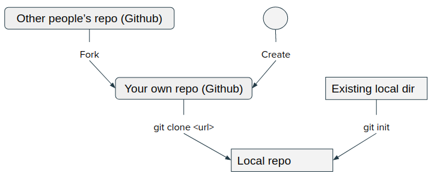

# How to contribute code using git

## Part 1. One-time set up

### Identity:
```
git config --global user.name "<Your Name>"  
git config --global user.email <your email>
```

### Save credential for 6 hours:
```
git config --global credential.helper 'cache --timeout=21600'
```

### Save credential permanently:
```
git config --global credential.helper store
```

### Alias of showing git history
Add this to ~/.gitconfig

```
[alias]
lg = log --graph --abbrev-commit --decorate --format=format:'%C(bold blue)%h%C(reset) - %C(bold green)(%ar)%C(reset) %C(white)%s%C(reset) %C(dim white)- %an%C(reset)%C(bold yellow)%d%C(reset)' --all
```

## Start a new repository



### Clone a remote repo:
Clone a remote repo to local computer:
```
git clone <url>
```

### Convert a local directory:
Convert an existing local directory to local git repository:
```
git init
```