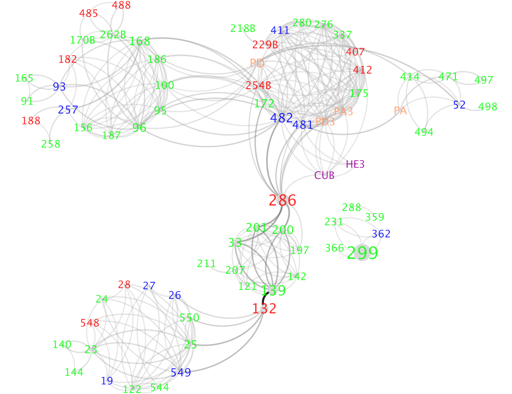

# Compute hydrogen bond network
<small><i>Page last updated on: {{ git_revision_date }}</i></small>

Hydrogen bond network obtained from MCCE is the hydrogen bonds existing in protein in Boltzmann distribution. The network helps reveal proton transclocation pathways, water pathways involving in the protein. The relative publication is on [Cytochrome c Oxidase](https://www.sciencedirect.com/science/article/pii/S0005272818301257).



# Table of Contents

1. [Principle](hbexample.md#Principle-of-MCCE-Hydrogen-bond-network-analysis)
2. [Input](hbexample.md#Inputs-for-each-steps)
3. [Output](hbexample.md#Outputs-for-each-steps)
4. [File format](hbexample.md#File-format-for-each-correspinding-file)
5. [Example](hbexample.md#Example-to-run-hydrogen-bond-network-analysis-in-MCCE)
6. [Supplement](hbexample.md#Supplement)


## Principle of MCCE Hydrogen bond network analysis
The hydrogen bond network in MCCE is obtained from microstates in Boltzmann Distribution in Monte Carlo sampling, based on defined D-H...D distance and angle, where D is the donor atom with a lone pair.

1. Save microstates with Boltzmann Distribution in Monte Carlo sampling.
2. Calculate all possible hydrogen bonds exist between residue conformers. A hydrogen bond matrix is obtatined.
3. Coupling with microstates (Step 1) and hydrogen bond matrix (Step 2), hydrogen bonds selected in miscrostates in Monte Carlo sampling are calculated.

## Inputs for each steps
1. Monte Carlo sampling microstates is obtained from **energies** and **head3.lst**.
2. Hydrogen bond matrix is obtatined from **step2_out.pdb** and **head3.lst**.
3. Selected hydrogen bond network is calculated based on **hb.dat** and **microstate** file, which is in ms_out folder.

## Outputs for each steps 
1. **pH#eH#ms.txt** under ms_out folder is generated for each pH and eH titration, where each file is named after titration point of pH and eH value following by 'ms'.
2. Hydrogen bond matrix is saved in **hb.dat** and **hah.txt**, where hb.dat is a binary file and hah.txt is a readable txt file. hb.dat has 2D matrix with N * N, where N is the total conformer number in the protein. hah.txt stores the geometry infos for each hydrogen bond. **resInHbNet.txt** contains the all residues that can be involved in hydrogen bond network. **reshbond.txt** contains all possible bonds between residues. 
3. **pH#eH#hb.txt** under hb_out folder is obtained for each pH and eH titration, where each file is named after titration point of pH and eH value foloowing by 'hb'.

## File format for each correspinding file
1. **pH#eH#ms.txt**: 
Comment line and blank line are dismissed.
Each file starts with headers, consist of monte carlo sampling unchanged information.
Then it stores the new conformer id for each microstate, and its relative energy and times it stay at this microstate. 

- **First line**: Temperature, pH, eH values
- **Second line**: Method to get microstate. Either MONTERUNS or ENUMERATE, representing from monte carlo sampling or analytical method
- **Third line**: n_fixed, the number of fixed residues for sampling. Following are the occupied conformer ids for each fixed residue, splitted by space.
- **Fourth line**: n_free, the number of free titrated residues that can get flipped during sampling. Follwing are all conformer ids, splitted by space for each free titrated residue, splitted by semicolon.

- **For each Monte Carlo sampling**:
- **Fifth line**: order of monte carlo sampling
- **Fifth line**: n_free, following occupied conformer id for each free titrated residue. This is the starting state for the sampling. The starting state will be decided by its energy to be accpeted or not.
- **Sixth line**: Energy of microstate, counter representing times the microstate stays, new conformer ids compared to last microstate. 

```
T:298.15,pH:7.00,eH:0.00
METHOD:MONTERUNS
#N_FIXED:FIXED_CONF_ID
33:4 5 16 17 18 19 20 35 39 93 94 103 104 105 111 119 128 129 138 145 157 158 176 199 216 217 226 232 239 708 762 854 919
#N_FREE residues:CONF_IDs for each free residues
43:0 1 2 3 ;6 7 10 11 ;27 28 ;29 30 31 32 33 34 ; ...
#EVERY MONTERUN START FROM A NEW STATE
#MC:ITER_MONTERUNS
#N_FREE: FREE_CONF_ID,
#ENERGY, COUNT,NEW_CONF

MC:0
43:1 7 28 31 48 53 56 61 92 106 121 137 140 147 156 167 175 178 183 222 227 234 241 256 269 327 351 383 417 449 472 502 542 552 583 728 769 804 882 945 1008 1059 1112
-93.403641,9,
-93.274643,3,782
-93.646645,1,63
...

MC:1
43:0 7 28 30 48 50 55 60 92 106 127 137 140 146 156 167 175 178 183 222 227 235 245 256 269 327 342 373 417 449 472 502 542 546 594 729 791 797 901 941 1008 1059 1112
-92.401054,3,
-91.990730,4,121 925
-93.319809,9,572
...
```
2. **hb.dat**: 
- First integer(4 bite): n_conf, the total conformer number of the protein. 
- The following is n_conf * n_conf matrix where 1 represents a hydrogen bond and 0 no hydrogen bond.
3. **hah.txt**: 
- Conformer_id of Donor, Conformer_id of Acceptor, Donor Atom, ~ Hyrogen-- Acceptor Atom, Distance, Angle
```
GLN01A0002_001  HOH01A0109_001   NE2~2HE2-- O   3.02    160
GLN01A0002_001  HOH01A0109_002   NE2~2HE2-- O   3.02    160
```
4. **resInHbNet.txt**: 
- residue_name involving hydrogen bond network
```
META0001
GLNA0002
TYRA0003
LYSA0004
```
5. **reshbond.txt**: 
- Residue_name of Donor,     Residue_name of Acceptor 
```
GLNA0002        HOHA0109
TYRA0003        META0001
TYRA0003        HOHA0070
TYRA0003        HOHA0132
```
6. **pH#eH#hb.txt**: 
- Donor Residue,      Acceptro Residue,       Occupancy of hydrogen bond in all microstates
```
LYSA0050        META0001        1.000
LYSA0050        ASPA0047        1.000
GLNA0002        HOHA0109        0.750
LYSA0004        GLUA0015        1.000
```

## Example to run hydrogen bond network analysis in MCCE
Here is a tutorial to calculate the hydrogen bond network using MCCE 
and to visualize hydrogen bond network using Cytoscape. 

### Parameter setting in run.prm:
1. Output microstate in MCCE step 4.
```
step 4:
t        Output Microstate from standard monte carlo        (MS_OUT)
```
2. Run Step 6 to get hydrogen bond network. 
- **"(GET_HBOND_MATRIX)"**: obtain hydrogen bond matrix from step2_out.pdb and head3.lst.
- **"(HBOND_LOWER_LIMIT)"**: setting for (GET_HBOND_MATRIX). Hydrogen bond distance lower limit.
- **"(HBOND_UPPER_LIMIT)"**: setting for (GET_HBOND_MATRIX). Hydrogen bond distance upper limit.
- **"(HBOND_ANG_CUTOFF)"**: setting for (GET_HBOND_MATRIX). Hydrogen bond angle cutoff, only angle larger than the cutoff will be considered hydrogen bond.
- **"(GET_HBOND_NETWORK)"**: obtain hydrogen bond network in Botlzmann distribution based on hb.dat and microstate file.

- Hydrogen bond donor and acceptor attom parameters are setting in **param04/hb.tpl**.
```
HDONOR   ASP01       HD1
HDONOR   ASP02       HD2

HACCEPT  ASP01       OD1  OD2
HACCEPT  ASP02       OD1  OD2
HACCEPT  ASP-1       OD1  OD2
```

Default hydrogen bond definition in run.prm is:

```
Step 6:
t        Obtain hydrogen bond matrix                        (GET_HBOND_MATRIX)
1.2      Lower limit of hydrogen bond H--B distance         (HBOND_LOWER_LIMIT)
3.2      Upper limit of hydrogen bond H--B distance         (HBOND_UPPER_LIMIT)
90.0     Angle cutoff of hydrogen bond                      (HBOND_ANG_CUTOFF)
t        Obtain hydrogen bond network                       (GET_HBOND_NETWORK)
```

2. Output file after step 6: hb.txt if final hydrogen bond network.
- hb.dat, hah.txt, resInHbNet.txt, reshbonds.txt from **(GET_HBOND_MATRIX)**.
- hb.txt from **(GET_HBOND_NETWORK)**.

### Result Analysis:
#### Cytoscape visualization:
We are using Cytoscape for visualizing hydrogen bond networks. 
Download and install [Cytoscape](https://cytoscape.org/).

#### Input file preparation for Cytoscape:
- hb.txt: hydrogen bond network with direct hydrogen bond between residues/waters, which is the direct output after MCCE.
- out.dat: aggrageted hydrogen bond network coupling with water for multiple hydrogen bond networks, which needs post-analysis based on hb.txt.
> **Steps to get out.dat:
> **Inputs**: 
> - Multiple hb.txt files: rename them as 1.dat, 2.dat, 3.dat etc.
> - Residues_list.lst: residues list selected.
> ```
> ARGA0019
> ASPA0028
> LYSA0027
> TYRA0122
> ASNA0025
> ```
>
> **Scripts**: /home/cai/source/jlu_net20170830
> - jhead.h: water molecules cutoff represents the maximum water number allowing to bridging hydrogen bond between residues. Here 4 is  up to 4 water molecules are allowed to bridge between two residues. For example, if you want to see up to  two water bridging hydrogen bond connections between two residues, 
then you can change 4 to 2.
> ```
> static int cutoff = 4;
> ```
> - jlu_new-cai.cpp: flags if output relevent files.
> ```
> const int flag_interest=0;            //flag to study interested residues: T100 and E286 
> const int flag_matrix=1;              //flag to output matrix of hb network
> const int flag_network=1;             //flag to output network with donor, acceptor, occ
> const int flag_network_opt=1;         //flag to output network with shorter name
> const int flag_map=1;                 //flag to output classification of amino acids in network
> const int flag_sif=1;                 //flag to output network with format of sif
> const int flag_cat_3s8f=0;            //flag to sync the cofactor name to protein 3s8f.pdb in sifformat
> const int flag_cat_1m56=1;            //flag to sync the cofactor name to protein 1m56.pdb in sifformat
> ```
> - jhead-test2.cpp
> - Makefile: `a-4w.out` in makefile, output name after compiling, can be changed. Here for up to 4 water, we write  `a-4w.out`. Suppose for two water: change `a-4w.out` to `a-2w.out`
> ```bash
> make
> ```
> - a-4w.out
> **Run scripts**: 
> ```bash
> ./a-4w.out
> ```
> **Outputs**:
> - out.txt: residue-residue hydrogen bond interacton, in a N * N matrix format
> - out.dat: residue-residue hydrogen bond interaction  
> ```
> DONOR   ACCEPT  OCCUPANCY
> RA0019  DA0028  100
> KA0027  NA0025  100
> NA0025  DA0028  100
> ```
> - out_opt.dat: residue-residue hydrogen bond interaction with opimal shorter residue name
> ```
> DONOR   ACCEPT  OCCUPANCY
> 19      28      100
> 27      25      100
> 25      28      100
> ```
> - out.sif: residue residue hydrogen bond interaction, with the format that can be used to connect 3D structure with cytoscape using RINalyzer
> - out_map.dat: residue's amnio acid type classification
> ```
> RESIDUE CLASS   FULL_NAME
> 19      B       ARGA0019
> 28      A       ASPA0028
> 27      B       LYSA0027
> ```
> - out_path.txt: water pathway that connect the two residues
> ```
> ARGA0019#####################ASPA0028
> GET:    ARGA0019, HOHS5631, ASPA0028,
> ```
> Here, water HOHS5631 helps bridge ARGA0019 - ASPA0028 hydrogen bond. 


#### Visualization on Cytoscape: 
Open `out.dat` file using the Cytoscape and play with different layout.

## Supplement
### Comparison between old and new hydrogen bond network
* Comparison between old and new format microstate file

|          | old_version | new_version |
| -------- | ----------- | ----------- |
|   time   |    58s      |     1s      |
|   size   |    246MB    |     27MB    |

* Comparison between old and new step 6

|         | old_version | new_version |
| --------| ----------- | ----------- |
|   time  |    117s     |     87s     |
