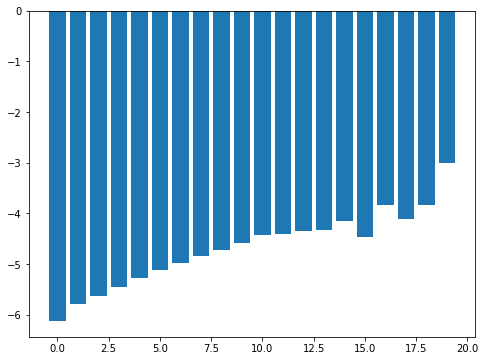

# How to use Microstate Analysis Library?
<small><i>Page last updated on: {{ git_revision_date }}</i></small>


## What is Microstate Analysis Library?
Monte Carlo sampling in MCCE evaluates protein residue side chains' choice of being at different positions and charge states. This process typically takes thousands of millions of steps and contains of a wealth of information such as:

* What microstates charge states are most likely at different energy level?
* What microstates are at the lowest energy of the sampling energy landscape?
* Do other residues respond to certain changes of a specific residue? 
 
Microstate Analysis Library is a tool set to replay Monte Carlo sampling and reveal the above information.

If you installed MCCE with conda/miniconda, Microstate Analysis Library is already included in the site-package path and it can be imported directly.  

If you installed MCCE from the source, Microstate Analysis Library is named as `ms_analysis.py` in bin directory. You need to copy this program to the same directory of your scripts or Jupyter Notebook to properly import it. 

## Get basic Monte Carlo sampling information
**Prerequisite:**

You need to enable microstate recording in MCCE step 4 to have microstates saved.
```
step4.py --ms
``` 

You will have a `ms_out` directory and microstate files like `pH0eH0ms.txt  pH10eH0ms.txt  pH11eH0ms.txt  pH12eH0ms.txt ...` under this directory.


**Import the library**


```python
import ms_analysis as msa
```

### Show basic information of a MC titration

Monte Carlo sapling steps are saved in files, one file at one totration condition. When we load the information back, one object is needed for one totration condition. 


```python
mc = msa.MSout("ms_out/pH4eH0ms.txt")
```


```python
print("Monte Carlo T  = %.3f" % mc.T)
print("Monte Carlo pH = %.3f" % mc.pH)
print("Monte Carlo Eh = %.3f" % mc.Eh)
print("Number of MC counts = %d" % mc.N_ms)
print("Number of microstates = %d" % mc.N_uniq)
print("The lowest E  = %.3f" % mc.lowest_E)
print("The average E = %.3f" % mc.average_E)
print("The hishest E = %.3f" % mc.highest_E)
```

    Monte Carlo T  = 298.150
    Monte Carlo pH = 4.000
    Monte Carlo Eh = 0.000
    Number of MC counts = 1500000
    Number of microstates = 266328
    The lowest E  = -226.198
    The average E = -221.267
    The hishest E = -206.544


### Access Conformer and Residue information

Conformers are not tied to Monte Carlo sampling, so it is a separate object in Microstate Analysis Library. Conformers have index of conformers, conformer ID, index of residues (not initialized), residue ID,  occupancy (not initialized), and charge.


```python
print("iconf ires         confid     resid   occ    crg")
for conf in msa.conformers:
    print("%5d %4d %s %s %5.3f %6.3f" % (conf.iconf, conf.ires, conf.confid, conf.resid, conf.occ, conf.crg))
```

    iconf ires         confid     resid   occ    crg
        0    0 NTR01A0001_001 NTRA0001_ 0.000  0.000
        1    0 NTR+1A0001_002 NTRA0001_ 0.000  1.000
        2    0 LYS01A0001_001 LYSA0001_ 0.000  0.000
        3    0 LYS+1A0001_002 LYSA0001_ 0.000  1.000
        4    0 VAL01A0002_001 VALA0002_ 0.000  0.000
        5    0 PHE01A0003_001 PHEA0003_ 0.000  0.000
        6    0 ARG01A0005_001 ARGA0005_ 0.000  0.000
        7    0 ARG02A0005_002 ARGA0005_ 0.000  0.000
        8    0 ARG02A0005_003 ARGA0005_ 0.000  0.000
        9    0 ARG03A0005_004 ARGA0005_ 0.000  0.000
       10    0 ARG+1A0005_005 ARGA0005_ 0.000  1.000
       11    0 CYD01A0006_001 CYDA0006_ 0.000  0.000
       12    0 GLU01A0007_001 GLUA0007_ 0.000  0.000
       13    0 GLU01A0007_002 GLUA0007_ 0.000  0.000
       14    0 GLU02A0007_003 GLUA0007_ 0.000  0.000
       15    0 GLU02A0007_004 GLUA0007_ 0.000  0.000
       16    0 GLU-1A0007_005 GLUA0007_ 0.000 -1.000
       17    0 LEU01A0008_001 LEUA0008_ 0.000  0.000
       18    0 ALA01A0009_001 ALAA0009_ 0.000  0.000
       19    0 ALA01A0010_001 ALAA0010_ 0.000  0.000
       20    0 ALA01A0011_001 ALAA0011_ 0.000  0.000
       21    0 MET01A0012_001 META0012_ 0.000  0.000
       22    0 LYS01A0013_001 LYSA0013_ 0.000  0.000
       23    0 LYS+1A0013_002 LYSA0013_ 0.000  1.000
       24    0 ARG01A0014_001 ARGA0014_ 0.000  0.000
       25    0 ARG02A0014_002 ARGA0014_ 0.000  0.000
       26    0 ARG03A0014_003 ARGA0014_ 0.000  0.000
       27    0 ARG+1A0014_004 ARGA0014_ 0.000  1.000
       28    0 HIS01A0015_001 HISA0015_ 0.000  0.000
       29    0 HIS01A0015_002 HISA0015_ 0.000  0.000
       30    0 HIS02A0015_003 HISA0015_ 0.000  0.000
       31    0 HIS02A0015_004 HISA0015_ 0.000  0.000
       32    0 HIS+1A0015_005 HISA0015_ 0.000  1.000
       33    0 HIS+1A0015_006 HISA0015_ 0.000  1.000
       34    0 LEU01A0017_001 LEUA0017_ 0.000  0.000
       35    0 ASP01A0018_001 ASPA0018_ 0.000  0.000
       36    0 ASP01A0018_002 ASPA0018_ 0.000  0.000
       37    0 ASP02A0018_003 ASPA0018_ 0.000  0.000
       38    0 ASP02A0018_004 ASPA0018_ 0.000  0.000
       39    0 ASP-1A0018_005 ASPA0018_ 0.000 -1.000
       40    0 ASN01A0019_001 ASNA0019_ 0.000  0.000
       41    0 TYR01A0020_001 TYRA0020_ 0.000  0.000
       42    0 TYR01A0020_002 TYRA0020_ 0.000  0.000
       43    0 TYR-1A0020_003 TYRA0020_ 0.000 -1.000
       44    0 ARG01A0021_001 ARGA0021_ 0.000  0.000
       45    0 ARG02A0021_002 ARGA0021_ 0.000  0.000
       46    0 ARG03A0021_003 ARGA0021_ 0.000  0.000
       47    0 ARG+1A0021_004 ARGA0021_ 0.000  1.000
       48    0 TYR01A0023_001 TYRA0023_ 0.000  0.000
       49    0 TYR-1A0023_002 TYRA0023_ 0.000 -1.000
       50    0 SER01A0024_001 SERA0024_ 0.000  0.000
       51    0 SER01A0024_002 SERA0024_ 0.000  0.000
       52    0 SER01A0024_003 SERA0024_ 0.000  0.000
       53    0 LEU01A0025_001 LEUA0025_ 0.000  0.000
       54    0 ASN01A0027_001 ASNA0027_ 0.000  0.000
       55    0 ASN01A0027_002 ASNA0027_ 0.000  0.000
       56    0 TRP01A0028_001 TRPA0028_ 0.000  0.000
       57    0 VAL01A0029_001 VALA0029_ 0.000  0.000
       58    0 CYD01A0030_001 CYDA0030_ 0.000  0.000
       59    0 ALA01A0031_001 ALAA0031_ 0.000  0.000
       60    0 ALA01A0032_001 ALAA0032_ 0.000  0.000
       61    0 LYS01A0033_001 LYSA0033_ 0.000  0.000
       62    0 LYS+1A0033_002 LYSA0033_ 0.000  1.000
       63    0 PHE01A0034_001 PHEA0034_ 0.000  0.000
       64    0 GLU01A0035_001 GLUA0035_ 0.000  0.000
       65    0 GLU01A0035_002 GLUA0035_ 0.000  0.000
       66    0 GLU02A0035_003 GLUA0035_ 0.000  0.000
       67    0 GLU02A0035_004 GLUA0035_ 0.000  0.000
       68    0 GLU-1A0035_005 GLUA0035_ 0.000 -1.000
       69    0 SER01A0036_001 SERA0036_ 0.000  0.000
       70    0 ASN01A0037_001 ASNA0037_ 0.000  0.000
       71    0 ASN01A0037_002 ASNA0037_ 0.000  0.000
       72    0 PHE01A0038_001 PHEA0038_ 0.000  0.000
       73    0 ASN01A0039_001 ASNA0039_ 0.000  0.000
       74    0 ASN01A0039_002 ASNA0039_ 0.000  0.000
       75    0 THR01A0040_001 THRA0040_ 0.000  0.000
       76    0 THR01A0040_002 THRA0040_ 0.000  0.000
       77    0 GLN01A0041_001 GLNA0041_ 0.000  0.000
       78    0 GLN01A0041_002 GLNA0041_ 0.000  0.000
       79    0 ALA01A0042_001 ALAA0042_ 0.000  0.000
       80    0 THR01A0043_001 THRA0043_ 0.000  0.000
       81    0 THR01A0043_002 THRA0043_ 0.000  0.000
       82    0 ASN01A0044_001 ASNA0044_ 0.000  0.000
       83    0 ASN01A0044_002 ASNA0044_ 0.000  0.000
       84    0 ARG01A0045_001 ARGA0045_ 0.000  0.000
       85    0 ARG02A0045_002 ARGA0045_ 0.000  0.000
       86    0 ARG03A0045_003 ARGA0045_ 0.000  0.000
       87    0 ARG+1A0045_004 ARGA0045_ 0.000  1.000
       88    0 ASN01A0046_001 ASNA0046_ 0.000  0.000
       89    0 ASN01A0046_002 ASNA0046_ 0.000  0.000
       90    0 ASN01A0046_003 ASNA0046_ 0.000  0.000
       91    0 ASN01A0046_004 ASNA0046_ 0.000  0.000
       92    0 THR01A0047_001 THRA0047_ 0.000  0.000
       93    0 ASP01A0048_001 ASPA0048_ 0.000  0.000
       94    0 ASP01A0048_002 ASPA0048_ 0.000  0.000
       95    0 ASP01A0048_003 ASPA0048_ 0.000  0.000
       96    0 ASP01A0048_004 ASPA0048_ 0.000  0.000
       97    0 ASP02A0048_005 ASPA0048_ 0.000  0.000
       98    0 ASP02A0048_006 ASPA0048_ 0.000  0.000
       99    0 ASP02A0048_007 ASPA0048_ 0.000  0.000
      100    0 ASP02A0048_008 ASPA0048_ 0.000  0.000
      101    0 ASP-1A0048_009 ASPA0048_ 0.000 -1.000
      102    0 ASP-1A0048_010 ASPA0048_ 0.000 -1.000
      103    0 SER01A0050_001 SERA0050_ 0.000  0.000
      104    0 SER01A0050_002 SERA0050_ 0.000  0.000
      105    0 SER01A0050_003 SERA0050_ 0.000  0.000
      106    0 THR01A0051_001 THRA0051_ 0.000  0.000
      107    0 THR01A0051_002 THRA0051_ 0.000  0.000
      108    0 ASP01A0052_001 ASPA0052_ 0.000  0.000
      109    0 ASP01A0052_002 ASPA0052_ 0.000  0.000
      110    0 ASP01A0052_003 ASPA0052_ 0.000  0.000
      111    0 ASP01A0052_004 ASPA0052_ 0.000  0.000
      112    0 ASP02A0052_005 ASPA0052_ 0.000  0.000
      113    0 ASP02A0052_006 ASPA0052_ 0.000  0.000
      114    0 ASP02A0052_007 ASPA0052_ 0.000  0.000
      115    0 ASP02A0052_008 ASPA0052_ 0.000  0.000
      116    0 ASP-1A0052_009 ASPA0052_ 0.000 -1.000
      117    0 ASP-1A0052_010 ASPA0052_ 0.000 -1.000
      118    0 TYR01A0053_001 TYRA0053_ 0.000  0.000
      119    0 TYR01A0053_002 TYRA0053_ 0.000  0.000
      120    0 TYR-1A0053_003 TYRA0053_ 0.000 -1.000
      121    0 ILE01A0055_001 ILEA0055_ 0.000  0.000
      122    0 LEU01A0056_001 LEUA0056_ 0.000  0.000
      123    0 GLN01A0057_001 GLNA0057_ 0.000  0.000
      124    0 GLN01A0057_002 GLNA0057_ 0.000  0.000
      125    0 ILE01A0058_001 ILEA0058_ 0.000  0.000
      126    0 ASN01A0059_001 ASNA0059_ 0.000  0.000
      127    0 ASN01A0059_002 ASNA0059_ 0.000  0.000
      128    0 ASN01A0059_003 ASNA0059_ 0.000  0.000
      129    0 ASN01A0059_004 ASNA0059_ 0.000  0.000
      130    0 SER01A0060_001 SERA0060_ 0.000  0.000
      131    0 SER01A0060_002 SERA0060_ 0.000  0.000
      132    0 SER01A0060_003 SERA0060_ 0.000  0.000
      133    0 SER01A0060_004 SERA0060_ 0.000  0.000
      134    0 SER01A0060_005 SERA0060_ 0.000  0.000
      135    0 ARG01A0061_001 ARGA0061_ 0.000  0.000
      136    0 ARG02A0061_002 ARGA0061_ 0.000  0.000
      137    0 ARG03A0061_003 ARGA0061_ 0.000  0.000
      138    0 ARG03A0061_004 ARGA0061_ 0.000  0.000
      139    0 ARG+1A0061_005 ARGA0061_ 0.000  1.000
      140    0 TRP01A0062_001 TRPA0062_ 0.000  0.000
      141    0 TRP01A0063_001 TRPA0063_ 0.000  0.000
      142    0 CYD01A0064_001 CYDA0064_ 0.000  0.000
      143    0 ASN01A0065_001 ASNA0065_ 0.000  0.000
      144    0 ASN01A0065_002 ASNA0065_ 0.000  0.000
      145    0 ASP01A0066_001 ASPA0066_ 0.000  0.000
      146    0 ASP01A0066_002 ASPA0066_ 0.000  0.000
      147    0 ASP01A0066_003 ASPA0066_ 0.000  0.000
      148    0 ASP01A0066_004 ASPA0066_ 0.000  0.000
      149    0 ASP02A0066_005 ASPA0066_ 0.000  0.000
      150    0 ASP02A0066_006 ASPA0066_ 0.000  0.000
      151    0 ASP02A0066_007 ASPA0066_ 0.000  0.000
      152    0 ASP02A0066_008 ASPA0066_ 0.000  0.000
      153    0 ASP-1A0066_009 ASPA0066_ 0.000 -1.000
      154    0 ASP-1A0066_010 ASPA0066_ 0.000 -1.000
      155    0 ARG01A0068_001 ARGA0068_ 0.000  0.000
      156    0 ARG02A0068_002 ARGA0068_ 0.000  0.000
      157    0 ARG03A0068_003 ARGA0068_ 0.000  0.000
      158    0 ARG+1A0068_004 ARGA0068_ 0.000  1.000
      159    0 THR01A0069_001 THRA0069_ 0.000  0.000
      160    0 THR01A0069_002 THRA0069_ 0.000  0.000
      161    0 THR01A0069_003 THRA0069_ 0.000  0.000
      162    0 PRO01A0070_001 PROA0070_ 0.000  0.000
      163    0 SER01A0072_001 SERA0072_ 0.000  0.000
      164    0 ARG01A0073_001 ARGA0073_ 0.000  0.000
      165    0 ARG02A0073_002 ARGA0073_ 0.000  0.000
      166    0 ARG03A0073_003 ARGA0073_ 0.000  0.000
      167    0 ARG+1A0073_004 ARGA0073_ 0.000  1.000
      168    0 ASN01A0074_001 ASNA0074_ 0.000  0.000
      169    0 ASN01A0074_002 ASNA0074_ 0.000  0.000
      170    0 LEU01A0075_001 LEUA0075_ 0.000  0.000
      171    0 CYD01A0076_001 CYDA0076_ 0.000  0.000
      172    0 ASN01A0077_001 ASNA0077_ 0.000  0.000
      173    0 ILE01A0078_001 ILEA0078_ 0.000  0.000
      174    0 PRO01A0079_001 PROA0079_ 0.000  0.000
      175    0 CYD01A0080_001 CYDA0080_ 0.000  0.000
      176    0 SER01A0081_001 SERA0081_ 0.000  0.000
      177    0 ALA01A0082_001 ALAA0082_ 0.000  0.000
      178    0 LEU01A0083_001 LEUA0083_ 0.000  0.000
      179    0 LEU01A0084_001 LEUA0084_ 0.000  0.000
      180    0 SER01A0085_001 SERA0085_ 0.000  0.000
      181    0 SER01A0085_002 SERA0085_ 0.000  0.000
      182    0 SER01A0086_001 SERA0086_ 0.000  0.000
      183    0 SER01A0086_002 SERA0086_ 0.000  0.000
      184    0 ASP01A0087_001 ASPA0087_ 0.000  0.000
      185    0 ASP01A0087_002 ASPA0087_ 0.000  0.000
      186    0 ASP02A0087_003 ASPA0087_ 0.000  0.000
      187    0 ASP02A0087_004 ASPA0087_ 0.000  0.000
      188    0 ASP-1A0087_005 ASPA0087_ 0.000 -1.000
      189    0 ILE01A0088_001 ILEA0088_ 0.000  0.000
      190    0 THR01A0089_001 THRA0089_ 0.000  0.000
      191    0 THR01A0089_002 THRA0089_ 0.000  0.000
      192    0 THR01A0089_003 THRA0089_ 0.000  0.000
      193    0 ALA01A0090_001 ALAA0090_ 0.000  0.000
      194    0 SER01A0091_001 SERA0091_ 0.000  0.000
      195    0 SER01A0091_002 SERA0091_ 0.000  0.000
      196    0 VAL01A0092_001 VALA0092_ 0.000  0.000
      197    0 ASN01A0093_001 ASNA0093_ 0.000  0.000
      198    0 ASN01A0093_002 ASNA0093_ 0.000  0.000
      199    0 CYD01A0094_001 CYDA0094_ 0.000  0.000
      200    0 ALA01A0095_001 ALAA0095_ 0.000  0.000
      201    0 LYS01A0096_001 LYSA0096_ 0.000  0.000
      202    0 LYS+1A0096_002 LYSA0096_ 0.000  1.000
      203    0 LYS01A0097_001 LYSA0097_ 0.000  0.000
      204    0 LYS+1A0097_002 LYSA0097_ 0.000  1.000
      205    0 ILE01A0098_001 ILEA0098_ 0.000  0.000
      206    0 VAL01A0099_001 VALA0099_ 0.000  0.000
      207    0 SER01A0100_001 SERA0100_ 0.000  0.000
      208    0 SER01A0100_002 SERA0100_ 0.000  0.000
      209    0 SER01A0100_003 SERA0100_ 0.000  0.000
      210    0 ASP01A0101_001 ASPA0101_ 0.000  0.000
      211    0 ASP01A0101_002 ASPA0101_ 0.000  0.000
      212    0 ASP02A0101_003 ASPA0101_ 0.000  0.000
      213    0 ASP02A0101_004 ASPA0101_ 0.000  0.000
      214    0 ASP-1A0101_005 ASPA0101_ 0.000 -1.000
      215    0 ASN01A0103_001 ASNA0103_ 0.000  0.000
      216    0 ASN01A0103_002 ASNA0103_ 0.000  0.000
      217    0 MET01A0105_001 META0105_ 0.000  0.000
      218    0 ASN01A0106_001 ASNA0106_ 0.000  0.000
      219    0 ASN01A0106_002 ASNA0106_ 0.000  0.000
      220    0 ALA01A0107_001 ALAA0107_ 0.000  0.000
      221    0 TRP01A0108_001 TRPA0108_ 0.000  0.000
      222    0 VAL01A0109_001 VALA0109_ 0.000  0.000
      223    0 ALA01A0110_001 ALAA0110_ 0.000  0.000
      224    0 TRP01A0111_001 TRPA0111_ 0.000  0.000
      225    0 ARG01A0112_001 ARGA0112_ 0.000  0.000
      226    0 ARG02A0112_002 ARGA0112_ 0.000  0.000
      227    0 ARG03A0112_003 ARGA0112_ 0.000  0.000
      228    0 ARG03A0112_004 ARGA0112_ 0.000  0.000
      229    0 ARG+1A0112_005 ARGA0112_ 0.000  1.000
      230    0 ASN01A0113_001 ASNA0113_ 0.000  0.000
      231    0 ASN01A0113_002 ASNA0113_ 0.000  0.000
      232    0 ARG01A0114_001 ARGA0114_ 0.000  0.000
      233    0 ARG02A0114_002 ARGA0114_ 0.000  0.000
      234    0 ARG03A0114_003 ARGA0114_ 0.000  0.000
      235    0 ARG+1A0114_004 ARGA0114_ 0.000  1.000
      236    0 CYD01A0115_001 CYDA0115_ 0.000  0.000
      237    0 LYS01A0116_001 LYSA0116_ 0.000  0.000
      238    0 LYS+1A0116_002 LYSA0116_ 0.000  1.000
      239    0 THR01A0118_001 THRA0118_ 0.000  0.000
      240    0 THR01A0118_002 THRA0118_ 0.000  0.000
      241    0 ASP01A0119_001 ASPA0119_ 0.000  0.000
      242    0 ASP01A0119_002 ASPA0119_ 0.000  0.000
      243    0 ASP02A0119_003 ASPA0119_ 0.000  0.000
      244    0 ASP02A0119_004 ASPA0119_ 0.000  0.000
      245    0 ASP-1A0119_005 ASPA0119_ 0.000 -1.000
      246    0 VAL01A0120_001 VALA0120_ 0.000  0.000
      247    0 GLN01A0121_001 GLNA0121_ 0.000  0.000
      248    0 GLN01A0121_002 GLNA0121_ 0.000  0.000
      249    0 ALA01A0122_001 ALAA0122_ 0.000  0.000
      250    0 TRP01A0123_001 TRPA0123_ 0.000  0.000
      251    0 ILE01A0124_001 ILEA0124_ 0.000  0.000
      252    0 ARG01A0125_001 ARGA0125_ 0.000  0.000
      253    0 ARG02A0125_002 ARGA0125_ 0.000  0.000
      254    0 ARG03A0125_003 ARGA0125_ 0.000  0.000
      255    0 ARG03A0125_004 ARGA0125_ 0.000  0.000
      256    0 ARG+1A0125_005 ARGA0125_ 0.000  1.000
      257    0 CYD01A0127_001 CYDA0127_ 0.000  0.000
      258    0 ARG01A0128_001 ARGA0128_ 0.000  0.000
      259    0 ARG02A0128_002 ARGA0128_ 0.000  0.000
      260    0 ARG03A0128_003 ARGA0128_ 0.000  0.000
      261    0 ARG+1A0128_004 ARGA0128_ 0.000  1.000
      262    0 LEU01A0129_001 LEUA0129_ 0.000  0.000
      263    0 CTR01A0129_001 CTRA0129_ 0.000  0.000
      264    0 CTR01A0129_002 CTRA0129_ 0.000  0.000
      265    0 CTR02A0129_003 CTRA0129_ 0.000  0.000
      266    0 CTR02A0129_004 CTRA0129_ 0.000  0.000
      267    0 CTR-1A0129_005 CTRA0129_ 0.000 -1.000


Residue information is put in Monte Carlo sampling. The reason is Monte Carlo sampling sets fixed conformers/residues aside, and only samples free residues and free conformers. In the Monte Carlo sampling output we have what conformers are fixed and what the free residues are composed.


```python
# fixed conformer indecies
print(mc.fixed_iconfs)
```

    [3, 4, 5, 10, 11, 17, 18, 19, 20, 21, 23, 27, 34, 40, 47, 48, 53, 56, 57, 58, 59, 60, 62, 63, 69, 72, 73, 79, 87, 92, 103, 121, 122, 125, 139, 140, 141, 142, 158, 162, 163, 167, 168, 170, 171, 172, 173, 174, 175, 176, 177, 178, 179, 189, 193, 196, 199, 200, 202, 204, 205, 206, 217, 220, 221, 222, 223, 224, 229, 235, 236, 238, 246, 249, 250, 251, 256, 257, 261, 262]


```python
# free residues expressed as index of conformers. It is a list of residues, and each residue has a list of conformers it can choose from.
for res in mc.free_residues:
    print(res)
```

    [0, 1]
    [13, 14, 15, 16]
    [29, 30, 32, 33]
    [36, 37, 38, 39]
    [41, 42]
    [50, 51, 52]
    [54, 55]
    [64, 65, 67, 68]
    [70, 71]
    [75, 76]
    [77, 78]
    [80, 81]
    [82, 83]
    [88, 89, 90, 91]
    [94, 97, 101, 102]
    [106, 107]
    [108, 109, 110, 111, 112, 113, 114, 115, 116, 117]
    [118, 119]
    [123, 124]
    [126, 127, 128, 129]
    [131, 132, 133, 134]
    [143, 144]
    [149, 153, 154]
    [159, 160, 161]
    [180, 181]
    [182, 183]
    [186, 188]
    [190, 191, 192]
    [194, 195]
    [197, 198]
    [207, 208, 209]
    [210, 211, 212, 213, 214]
    [215, 216]
    [218, 219]
    [230, 231]
    [239, 240]
    [241, 242, 243, 244, 245]
    [247, 248]
    [263, 264, 265, 266, 267]


To get a residue ID for free residues,we need to use conformer information because residue ID is in conformer record. 


```python
for res in mc.free_residues:
    print(msa.conformers[res[0]].resid)    # use resid from the first conformer in that residue
```

    NTRA0001_
    GLUA0007_
    HISA0015_
    ASPA0018_
    TYRA0020_
    SERA0024_
    ASNA0027_
    GLUA0035_
    ASNA0037_
    THRA0040_
    GLNA0041_
    THRA0043_
    ASNA0044_
    ASNA0046_
    ASPA0048_
    THRA0051_
    ASPA0052_
    TYRA0053_
    GLNA0057_
    ASNA0059_
    SERA0060_
    ASNA0065_
    ASPA0066_
    THRA0069_
    SERA0085_
    SERA0086_
    ASPA0087_
    THRA0089_
    SERA0091_
    ASNA0093_
    SERA0100_
    ASPA0101_
    ASNA0103_
    ASNA0106_
    ASNA0113_
    THRA0118_
    ASPA0119_
    GLNA0121_
    CTRA0129_


### Access microstates
Each microstate is stored as data structure:
```
class Microstate:
    def __init__(self, state, E, count):
        self.state = state
        self.E = E
        self.count = count
```
In which state is an array of conformer indecies. E is the state energy, count is the number of times this microstate is chosen.

Microstates are stored as a dictionary with the string value of state as the key, and Microstate as the value. One can get the list of microstates by


```python
microstates = list(mc.microstates.values())
# print first 10 entries
for ms in microstates[:10]:
    print(ms.state, ms.E, ms.count)
```

    [1, 15, 32, 39, 41, 51, 54, 65, 70, 76, 78, 80, 83, 88, 101, 106, 116, 119, 123, 126, 132, 143, 153, 160, 181, 183, 188, 192, 195, 197, 208, 210, 215, 219, 231, 239, 243, 247, 267] -220.605118 11
    [1, 15, 32, 39, 41, 51, 54, 65, 70, 76, 78, 80, 83, 88, 101, 107, 116, 119, 123, 126, 132, 143, 153, 160, 181, 183, 188, 192, 195, 197, 208, 210, 215, 219, 231, 239, 243, 247, 267] -220.287003 3
    [1, 15, 32, 39, 41, 51, 54, 65, 70, 76, 78, 80, 83, 88, 101, 107, 116, 119, 123, 126, 132, 143, 153, 160, 181, 183, 188, 192, 195, 197, 208, 210, 215, 219, 231, 239, 243, 248, 267] -220.543747 1
    [1, 15, 32, 39, 41, 51, 54, 65, 70, 76, 78, 80, 83, 88, 101, 107, 116, 119, 123, 126, 132, 144, 153, 160, 181, 183, 188, 192, 195, 197, 208, 210, 215, 219, 231, 239, 243, 248, 267] -219.397995 1
    [1, 15, 32, 39, 41, 51, 54, 65, 70, 76, 78, 80, 83, 88, 101, 107, 116, 119, 123, 126, 132, 144, 153, 160, 181, 182, 188, 192, 195, 197, 208, 210, 215, 219, 231, 239, 243, 248, 267] -217.926498 1
    [1, 15, 32, 39, 41, 51, 54, 65, 70, 76, 78, 80, 83, 88, 101, 107, 116, 119, 123, 126, 132, 143, 153, 160, 181, 182, 188, 192, 195, 197, 208, 210, 215, 219, 231, 239, 243, 248, 267] -219.07225 4
    [1, 15, 32, 39, 41, 51, 54, 65, 70, 76, 78, 80, 83, 88, 101, 107, 116, 119, 123, 126, 134, 143, 153, 160, 181, 182, 188, 192, 195, 197, 208, 210, 215, 219, 231, 239, 243, 248, 267] -218.826874 4
    [1, 15, 32, 39, 41, 51, 54, 65, 70, 76, 78, 80, 83, 91, 101, 107, 116, 119, 123, 126, 134, 143, 153, 160, 181, 182, 188, 192, 195, 197, 208, 210, 215, 219, 231, 239, 243, 248, 267] -218.07251 2
    [1, 15, 32, 39, 41, 51, 54, 65, 70, 76, 78, 80, 83, 91, 101, 107, 116, 119, 123, 126, 134, 143, 153, 160, 181, 183, 188, 192, 195, 197, 208, 210, 215, 219, 231, 239, 243, 248, 267] -219.544006 7
    [1, 16, 32, 39, 41, 51, 54, 65, 70, 76, 78, 80, 83, 91, 101, 107, 116, 119, 123, 126, 134, 143, 153, 160, 181, 183, 188, 192, 195, 197, 208, 210, 215, 219, 231, 239, 243, 248, 267] -221.183884 2


### Calculate residue charges for a group of conformers


```python
free_res_crg = msa.ms_convert2sumcrg(microstates, mc.free_residues)
for ir in range(len(mc.free_residues)):
    resname = msa.conformers[mc.free_residues[ir][0]].resid    # use resid from the first conformer in that residue
    print("%s %6.3f" % (resname, free_res_crg[ir]))
```

    NTRA0001_  0.992
    GLUA0007_ -0.733
    HISA0015_  0.995
    ASPA0018_ -0.962
    TYRA0020_  0.000
    SERA0024_  0.000
    ASNA0027_  0.000
    GLUA0035_ -0.090
    ASNA0037_  0.000
    THRA0040_  0.000
    GLNA0041_  0.000
    THRA0043_  0.000
    ASNA0044_  0.000
    ASNA0046_  0.000
    ASPA0048_ -0.991
    THRA0051_  0.000
    ASPA0052_ -0.698
    TYRA0053_  0.000
    GLNA0057_  0.000
    ASNA0059_  0.000
    SERA0060_  0.000
    ASNA0065_  0.000
    ASPA0066_ -0.987
    THRA0069_  0.000
    SERA0085_  0.000
    SERA0086_  0.000
    ASPA0087_ -0.977
    THRA0089_  0.000
    SERA0091_  0.000
    ASNA0093_  0.000
    SERA0100_  0.000
    ASPA0101_ -0.219
    ASNA0103_  0.000
    ASNA0106_  0.000
    ASNA0113_  0.000
    THRA0118_  0.000
    ASPA0119_ -0.670
    GLNA0121_  0.000
    CTRA0129_ -0.888


## Group microstates by energy
Here is an example to divide microstates into energy bands.
### Unique microstate couns and total counts over bands


```python
# get the energy bin size from the range of MC energy
e_step = (mc.highest_E - mc.lowest_E)/20
ticks = [mc.lowest_E + e_step*(i) for i in range(20)]
ms_in_bands = msa.groupms_byenergy(mc.microstates.values(), ticks)
uniqms_in_bands = [len(band) for band in ms_in_bands]
print(uniqms_in_bands)
```

    [234, 3387, 18352, 38339, 48204, 46960, 38989, 28568, 18870, 11624, 6654, 3420, 1617, 674, 243, 104, 55, 21, 11, 2]


```python
# Now compute the counts instead of unique microstates
counts_in_bands = [sum([ms.count for ms in band]) for band in ms_in_bands]
print(counts_in_bands)
```

    [31231, 96883, 181201, 240564, 254871, 227699, 176626, 122414, 77258, 45436, 24604, 12170, 5324, 2336, 743, 388, 165, 60, 23, 4]


```python
# plot them
import matplotlib.pyplot as plt
fig=plt.figure(figsize=(18,6))
ax1 = fig.add_subplot(121)
ax1.title.set_text('Unique microstates')    # charge over energy bands

ax1.bar([i for i in range(20)], uniqms_in_bands)

ax2 = fig.add_subplot(122)
ax2.title.set_text('Total counts')
ax2.bar([i for i in range(20)], counts_in_bands)

plt.show()
```


    

    


### Charge over energy bands


```python
crg_in_bands = []
for band in ms_in_bands:
    band_total_crg = 0.0
    for ms in band:
        band_total_crg += msa.ms_charge(ms)*ms.count
    crg_in_bands.append(band_total_crg/msa.ms_counts(band))

print(crg_in_bands)
```

    [-6.129454708462745, -5.798344394785463, -5.6241852969906345, -5.446471625014549, -5.284802900290735, -5.118779616950448, -4.983683036472547, -4.845483359746434, -4.724416888865878, -4.590610969275464, -4.436067306129084, -4.405012325390304, -4.340721262208866, -4.333476027397261, -4.141318977119784, -4.461340206185567, -3.8424242424242423, -4.116666666666666, -3.8260869565217392, -3.0]


```python
fig=plt.figure(figsize=(8,6))
plt.bar([i for i in range(20)], crg_in_bands)
plt.show()
```


    

    


### Which charge is the most populated


```python
counts_vs_charge = {}
for ms in mc.microstates.values():
    charge = int(msa.ms_charge(ms))
    if charge in counts_vs_charge:
        counts_vs_charge[charge] += ms.count
    else:
        counts_vs_charge[charge] = ms.count
```


```python
charges = list(counts_vs_charge.keys())
charges.sort()
counts_population = [counts_vs_charge[i] for i in charges]

fig=plt.figure(figsize=(8,6))
plt.bar(charges, counts_population)
plt.show()
```


    

    


## Group microstate by conformer selection and show what changed


```python
!grep A0035 head3.lst
```

    00065 GLU01A0035_001 f 0.00  0.000     0  0.00  0  0   2.062  -6.408   3.293  -0.967   1.795   0.000 01O000M000 t
    00066 GLU01A0035_002 f 0.00  0.000     0  0.00  0  0   2.062  -6.408   0.573  -1.299   1.375   0.000 01O000M000 t
    00067 GLU02A0035_003 f 0.00  0.000     0  0.00  0  0   1.629  -6.500   3.293   1.389   1.854   0.000 02O000M000 t
    00068 GLU02A0035_004 f 0.00  0.000     0  0.00  0  0   1.629  -6.500   0.573  -0.131   1.245   0.000 02O000M000 t
    00069 GLU-1A0035_005 f 0.00 -1.000     0  4.75  0 -1   1.573  -6.495   0.573  -2.810   4.319  -0.300 -1O000M000 t


```python
!grep A0035 fort.38
```

    GLU01A0035_001 0.058 0.058 0.061 0.060 0.053 0.036 0.012 0.000 0.000 0.000 0.000 0.000 0.000 0.000 0.000
    GLU01A0035_002 0.811 0.808 0.801 0.779 0.749 0.543 0.158 0.022 0.002 0.000 0.000 0.000 0.000 0.000 0.000
    GLU02A0035_003 0.000 0.001 0.000 0.000 0.000 0.000 0.000 0.000 0.000 0.000 0.000 0.000 0.000 0.000 0.000
    GLU02A0035_004 0.132 0.133 0.135 0.138 0.107 0.080 0.024 0.000 0.000 0.000 0.000 0.000 0.000 0.000 0.000
    GLU-1A0035_005 0.000 0.000 0.004 0.023 0.090 0.341 0.807 0.978 0.998 1.000 1.000 1.000 1.000 1.000 1.000


Group microstates by conformer index numbers. If any conformer in the list appears in the microstate, this microstate will be put in the first group, otherwise in the second group.


```python
netural, charged = msa.groupms_byiconf(mc.microstates.values(), [64, 65, 66, 67])
```

See what conformer has changed by calculating conformer occupancy difference.


```python
# what conformers have changed
diff_occ = msa.whatchanged_conf(netural, charged)
for key in diff_occ.keys():
    print("%3d, %s: %6.3f" % (key, msa.conformers[key].confid, diff_occ[key]))
```

      0, NTR01A0001_001:  0.000
      1, NTR+1A0001_002: -0.000
     13, GLU01A0007_002:  0.001
     14, GLU02A0007_003:  0.003
     15, GLU02A0007_004: -0.003
     16, GLU-1A0007_005: -0.001
     29, HIS01A0015_002: -0.001
     30, HIS02A0015_003: -0.000
     32, HIS+1A0015_005: -0.003
     33, HIS+1A0015_006:  0.004
     36, ASP01A0018_002:  0.003
     37, ASP02A0018_003: -0.001
     38, ASP02A0018_004: -0.001
     39, ASP-1A0018_005: -0.001
     41, TYR01A0020_001: -0.006
     42, TYR01A0020_002:  0.006
     50, SER01A0024_001:  0.009
     51, SER01A0024_002: -0.007
     52, SER01A0024_003: -0.002
     54, ASN01A0027_001: -0.019
     55, ASN01A0027_002:  0.019
     64, GLU01A0035_001: -0.058
     65, GLU01A0035_002: -0.823
     67, GLU02A0035_004: -0.118
     68, GLU-1A0035_005:  1.000
     70, ASN01A0037_001:  0.004
     71, ASN01A0037_002: -0.004
     75, THR01A0040_001:  0.001
     76, THR01A0040_002: -0.001
     77, GLN01A0041_001: -0.003
     78, GLN01A0041_002:  0.003
     80, THR01A0043_001:  0.005
     81, THR01A0043_002: -0.005
     82, ASN01A0044_001: -0.246
     83, ASN01A0044_002:  0.246
     88, ASN01A0046_001: -0.205
     89, ASN01A0046_002:  0.147
     90, ASN01A0046_003:  0.126
     91, ASN01A0046_004: -0.068
     94, ASP01A0048_002: -0.000
     97, ASP02A0048_005:  0.001
    101, ASP-1A0048_009: -0.009
    102, ASP-1A0048_010:  0.008
    106, THR01A0051_001: -0.005
    107, THR01A0051_002:  0.005
    108, ASP01A0052_001:  0.002
    109, ASP01A0052_002: -0.000
    110, ASP01A0052_003:  0.020
    111, ASP01A0052_004:  0.004
    112, ASP02A0052_005:  0.192
    113, ASP02A0052_006:  0.016
    114, ASP02A0052_007:  0.126
    115, ASP02A0052_008:  0.008
    116, ASP-1A0052_009: -0.349
    117, ASP-1A0052_010: -0.020
    118, TYR01A0053_001:  0.001
    119, TYR01A0053_002: -0.001
    123, GLN01A0057_001:  0.004
    124, GLN01A0057_002: -0.004
    126, ASN01A0059_001: -0.008
    127, ASN01A0059_002:  0.001
    128, ASN01A0059_003:  0.007
    129, ASN01A0059_004: -0.000
    131, SER01A0060_002:  0.002
    132, SER01A0060_003: -0.028
    133, SER01A0060_004: -0.002
    134, SER01A0060_005:  0.028
    143, ASN01A0065_001:  0.003
    144, ASN01A0065_002: -0.003
    149, ASP02A0066_005:  0.001
    153, ASP-1A0066_009:  0.001
    154, ASP-1A0066_010: -0.002
    159, THR01A0069_001:  0.002
    160, THR01A0069_002: -0.006
    161, THR01A0069_003:  0.004
    180, SER01A0085_001:  0.004
    181, SER01A0085_002: -0.004
    182, SER01A0086_001: -0.001
    183, SER01A0086_002:  0.001
    186, ASP02A0087_003: -0.005
    188, ASP-1A0087_005:  0.005
    190, THR01A0089_001: -0.000
    191, THR01A0089_002:  0.009
    192, THR01A0089_003: -0.009
    194, SER01A0091_001:  0.008
    195, SER01A0091_002: -0.008
    197, ASN01A0093_001: -0.004
    198, ASN01A0093_002:  0.004
    207, SER01A0100_001: -0.012
    208, SER01A0100_002:  0.003
    209, SER01A0100_003:  0.009
    210, ASP01A0101_001:  0.005
    211, ASP01A0101_002:  0.001
    212, ASP02A0101_003: -0.003
    213, ASP02A0101_004:  0.013
    214, ASP-1A0101_005: -0.017
    215, ASN01A0103_001: -0.002
    216, ASN01A0103_002:  0.002
    218, ASN01A0106_001:  0.003
    219, ASN01A0106_002: -0.003
    230, ASN01A0113_001:  0.056
    231, ASN01A0113_002: -0.056
    239, THR01A0118_001: -0.000
    240, THR01A0118_002:  0.000
    241, ASP01A0119_001:  0.003
    242, ASP01A0119_002:  0.000
    243, ASP02A0119_003:  0.019
    244, ASP02A0119_004:  0.000
    245, ASP-1A0119_005: -0.023
    247, GLN01A0121_001: -0.003
    248, GLN01A0121_002:  0.003
    263, CTR01A0129_001: -0.001
    264, CTR01A0129_002: -0.003
    265, CTR02A0129_003: -0.003
    266, CTR02A0129_004: -0.003
    267, CTR-1A0129_005:  0.010


See what has changed in terms of residue's conformer population change. The residue difference is measured by Bhattachayya distance of residues' conformer populations.


```python
# What residues have changed
diff_bhd = msa.whatchanged_res(netural, charged, mc.free_residues)
resname = []
bhd = []
for ir in range(len(mc.free_residues)):
    if diff_bhd[ir] < 99.0:
        resname.append(msa.conformers[mc.free_residues[ir][0]].resid)
        bhd.append(diff_bhd[ir])
```


```python
def autolabel(rects, ax):
    """Attach a text label above each bar in *rects*, displaying its height."""
    for rect in rects:
        height = rect.get_height()
        ax.annotate('%.3f' % height,
                    xy=(rect.get_x() + rect.get_width() / 2, height),
                    xytext=(0, 3),  # 3 points vertical offset
                    textcoords="offset points",
                    ha='center', va='bottom')

```


```python
import numpy as np
x = np.arange(len(resname))
width = 0.2

fig, ax = plt.subplots(figsize=(18,8))
rects = ax.bar(x, bhd, width)
ax.set_ylabel("Residue difference measured by Bhattachayya distance")
autolabel(rects, ax)
plt.xticks(x, resname, rotation='vertical')
plt.show()
```


    

    


## Group microstate by conformer names, and chained selection


```python
confnames = [conf.confid for conf in msa.conformers]
for confname in confnames:
    print(confname)
```

    NTR01A0001_001
    NTR+1A0001_002
    LYS01A0001_001
    LYS+1A0001_002
    VAL01A0002_001
    PHE01A0003_001
    ARG01A0005_001
    ARG02A0005_002
    ARG02A0005_003
    ARG03A0005_004
    ARG+1A0005_005
    CYD01A0006_001
    GLU01A0007_001
    GLU01A0007_002
    GLU02A0007_003
    GLU02A0007_004
    GLU-1A0007_005
    LEU01A0008_001
    ALA01A0009_001
    ALA01A0010_001
    ALA01A0011_001
    MET01A0012_001
    LYS01A0013_001
    LYS+1A0013_002
    ARG01A0014_001
    ARG02A0014_002
    ARG03A0014_003
    ARG+1A0014_004
    HIS01A0015_001
    HIS01A0015_002
    HIS02A0015_003
    HIS02A0015_004
    HIS+1A0015_005
    HIS+1A0015_006
    LEU01A0017_001
    ASP01A0018_001
    ASP01A0018_002
    ASP02A0018_003
    ASP02A0018_004
    ASP-1A0018_005
    ASN01A0019_001
    TYR01A0020_001
    TYR01A0020_002
    TYR-1A0020_003
    ARG01A0021_001
    ARG02A0021_002
    ARG03A0021_003
    ARG+1A0021_004
    TYR01A0023_001
    TYR-1A0023_002
    SER01A0024_001
    SER01A0024_002
    SER01A0024_003
    LEU01A0025_001
    ASN01A0027_001
    ASN01A0027_002
    TRP01A0028_001
    VAL01A0029_001
    CYD01A0030_001
    ALA01A0031_001
    ALA01A0032_001
    LYS01A0033_001
    LYS+1A0033_002
    PHE01A0034_001
    GLU01A0035_001
    GLU01A0035_002
    GLU02A0035_003
    GLU02A0035_004
    GLU-1A0035_005
    SER01A0036_001
    ASN01A0037_001
    ASN01A0037_002
    PHE01A0038_001
    ASN01A0039_001
    ASN01A0039_002
    THR01A0040_001
    THR01A0040_002
    GLN01A0041_001
    GLN01A0041_002
    ALA01A0042_001
    THR01A0043_001
    THR01A0043_002
    ASN01A0044_001
    ASN01A0044_002
    ARG01A0045_001
    ARG02A0045_002
    ARG03A0045_003
    ARG+1A0045_004
    ASN01A0046_001
    ASN01A0046_002
    ASN01A0046_003
    ASN01A0046_004
    THR01A0047_001
    ASP01A0048_001
    ASP01A0048_002
    ASP01A0048_003
    ASP01A0048_004
    ASP02A0048_005
    ASP02A0048_006
    ASP02A0048_007
    ASP02A0048_008
    ASP-1A0048_009
    ASP-1A0048_010
    SER01A0050_001
    SER01A0050_002
    SER01A0050_003
    THR01A0051_001
    THR01A0051_002
    ASP01A0052_001
    ASP01A0052_002
    ASP01A0052_003
    ASP01A0052_004
    ASP02A0052_005
    ASP02A0052_006
    ASP02A0052_007
    ASP02A0052_008
    ASP-1A0052_009
    ASP-1A0052_010
    TYR01A0053_001
    TYR01A0053_002
    TYR-1A0053_003
    ILE01A0055_001
    LEU01A0056_001
    GLN01A0057_001
    GLN01A0057_002
    ILE01A0058_001
    ASN01A0059_001
    ASN01A0059_002
    ASN01A0059_003
    ASN01A0059_004
    SER01A0060_001
    SER01A0060_002
    SER01A0060_003
    SER01A0060_004
    SER01A0060_005
    ARG01A0061_001
    ARG02A0061_002
    ARG03A0061_003
    ARG03A0061_004
    ARG+1A0061_005
    TRP01A0062_001
    TRP01A0063_001
    CYD01A0064_001
    ASN01A0065_001
    ASN01A0065_002
    ASP01A0066_001
    ASP01A0066_002
    ASP01A0066_003
    ASP01A0066_004
    ASP02A0066_005
    ASP02A0066_006
    ASP02A0066_007
    ASP02A0066_008
    ASP-1A0066_009
    ASP-1A0066_010
    ARG01A0068_001
    ARG02A0068_002
    ARG03A0068_003
    ARG+1A0068_004
    THR01A0069_001
    THR01A0069_002
    THR01A0069_003
    PRO01A0070_001
    SER01A0072_001
    ARG01A0073_001
    ARG02A0073_002
    ARG03A0073_003
    ARG+1A0073_004
    ASN01A0074_001
    ASN01A0074_002
    LEU01A0075_001
    CYD01A0076_001
    ASN01A0077_001
    ILE01A0078_001
    PRO01A0079_001
    CYD01A0080_001
    SER01A0081_001
    ALA01A0082_001
    LEU01A0083_001
    LEU01A0084_001
    SER01A0085_001
    SER01A0085_002
    SER01A0086_001
    SER01A0086_002
    ASP01A0087_001
    ASP01A0087_002
    ASP02A0087_003
    ASP02A0087_004
    ASP-1A0087_005
    ILE01A0088_001
    THR01A0089_001
    THR01A0089_002
    THR01A0089_003
    ALA01A0090_001
    SER01A0091_001
    SER01A0091_002
    VAL01A0092_001
    ASN01A0093_001
    ASN01A0093_002
    CYD01A0094_001
    ALA01A0095_001
    LYS01A0096_001
    LYS+1A0096_002
    LYS01A0097_001
    LYS+1A0097_002
    ILE01A0098_001
    VAL01A0099_001
    SER01A0100_001
    SER01A0100_002
    SER01A0100_003
    ASP01A0101_001
    ASP01A0101_002
    ASP02A0101_003
    ASP02A0101_004
    ASP-1A0101_005
    ASN01A0103_001
    ASN01A0103_002
    MET01A0105_001
    ASN01A0106_001
    ASN01A0106_002
    ALA01A0107_001
    TRP01A0108_001
    VAL01A0109_001
    ALA01A0110_001
    TRP01A0111_001
    ARG01A0112_001
    ARG02A0112_002
    ARG03A0112_003
    ARG03A0112_004
    ARG+1A0112_005
    ASN01A0113_001
    ASN01A0113_002
    ARG01A0114_001
    ARG02A0114_002
    ARG03A0114_003
    ARG+1A0114_004
    CYD01A0115_001
    LYS01A0116_001
    LYS+1A0116_002
    THR01A0118_001
    THR01A0118_002
    ASP01A0119_001
    ASP01A0119_002
    ASP02A0119_003
    ASP02A0119_004
    ASP-1A0119_005
    VAL01A0120_001
    GLN01A0121_001
    GLN01A0121_002
    ALA01A0122_001
    TRP01A0123_001
    ILE01A0124_001
    ARG01A0125_001
    ARG02A0125_002
    ARG03A0125_003
    ARG03A0125_004
    ARG+1A0125_005
    CYD01A0127_001
    ARG01A0128_001
    ARG02A0128_002
    ARG03A0128_003
    ARG+1A0128_004
    LEU01A0129_001
    CTR01A0129_001
    CTR01A0129_002
    CTR02A0129_003
    CTR02A0129_004
    CTR-1A0129_005


You can Group conformers by the conformer IDs. IDs are in a list, and each ID is considered as a match as long as it is a substring of the conformer name. The selected microstates that contain all conformers in the ID list will be returned in the first group, and the rest are in the second group.


```python
# Let's select charged GLU35
glu35_charged, _ = msa.groupms_byconfid(microstates, ["GLU-1A0035"])
print(len(glu35_charged))
```

    28695


```python
# find charged ASP48 from the above selected conformers
glu35_asp48_charged, _ = msa.groupms_byconfid(glu35_charged, ["ASP-1A0048"])
print(len(glu35_asp48_charged))
```

    28379


```python
# Or we can do it in one command
glu35_asp48_charged2, _ = msa.groupms_byconfid(microstates, ["GLU-1A0035", "ASP-1A0048"])
print(len(glu35_asp48_charged2))
```

    28379

