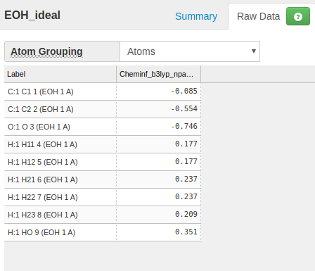

# How to make a new topology file?
<small><i>Page last updated on: {{ git_revision_date }}</i></small>

Topology file defines a molecule, including the atom connectivity, atom charge and radius, how conformers are made etc.

## General format of ftpl file
The format of free format tpl file is simple. It is simply a key value pair separated by ":".

The key can be up to three fields, separated by ",". The first key field is primary key, describing what kind of record it is, and the other two keys are supplementary, describing what molecule/conformer/atom it belongs to. The Value is a string, and will be processed by the mcce program in the context of key. If a space is a part of the key or value, it must be quoted inside double quotes.

":", "," and "#" are reserved, and can not be used as part of key and value. The following is an example:

 * Any text after "#" is considered comment.
 * Any line that doesn't have ":" is considered as comment


```
CONNECT, " N ", GLUBK: sp2, " ? ", " CA ", " H "

```

MCCE reads in lines from ftpl files and save them in a single database. The content in multiple ftpl files are compiled into the database. Therefore one ftpl file can define multiple residues, and one residue parameter lines can be spread in multiple files.

If the same key appears more than once, only the value of the last one is valid. This means the previous loaded value under this key will be overwritten.

The order of reading ftpl files is alphabetic order of the file names.


## Reference of ftpl records

### Conformer list
Example:
```
CONFLIST, GLU: GLUBK, GLU01, GLU02, GLU-1
```
**This is a required parameter for a molecule**

This parameter tells MCCE that residue GLU has 4 conformers.

A conformer is named in as a 3-char residue name + 2-char conformer label.

The conformer that ends with BK is a special backbone conformer. The atoms of the backbone conformerdo not change charge and protonation states. They and the atoms of one of the other side chain conformers make up the residue. In addition backbone conformers of all residues are grouped into one big chunck for energy calculation.

Conformers other than backbone conformer are side chain conformers. They differ with each other by atom charge, bond connection, or proton number.

Another special type conformer ends with "DM" as a convention name. The "DM" is not required. It has 0 atoms (no matching CONNECT parameters), and it represents the absence of this conformer, such as water leaving the site.

### Atom and bonds
Example:
```
CONNECT, " N  ", GLUBK: sp2, " ?  ", " CA ", " H  "
CONNECT, " H  ", GLUBK: s, " N  "
CONNECT, " CA ", GLUBK: sp3, " N  ", " C  ", " CB ", " HA "
CONNECT, " HA ", GLUBK: s, " CA "
CONNECT, " C  ", GLUBK: sp2, " CA ", " O  ", " ?  "
CONNECT, " O  ", GLUBK: sp2, " C  "
CONNECT, " CB ", GLU01: sp3, " CA ", " CG ", " HB2", " HB3"
CONNECT, " HB2", GLU01: s, " CB "
CONNECT, " HB3", GLU01: s, " CB "
CONNECT, " CG ", GLU01: sp3, " CB ", " CD ", " HG2", " HG3"
CONNECT, " HG2", GLU01: s, " CG "
CONNECT, " HG3", GLU01: s, " CG "
CONNECT, " CD ", GLU01: sp2, " CG ", " OE1", " OE2"
CONNECT, " OE1", GLU01: sp3, " CD ", " HE1"
CONNECT, " HE1", GLU01: s, " OE1"
CONNECT, " OE2", GLU01: s, " CD "
CONNECT, " CB ", GLU02: sp3, " CA ", " CG ", " HB2", " HB3"
CONNECT, " HB2", GLU02: s, " CB "
CONNECT, " HB3", GLU02: s, " CB "
CONNECT, " CG ", GLU02: sp3, " CB ", " CD ", " HG2", " HG3"
CONNECT, " HG2", GLU02: s, " CG "
CONNECT, " HG3", GLU02: s, " CG "
CONNECT, " CD ", GLU02: sp2, " CG ", " OE1", " OE2"
CONNECT, " OE1", GLU02: s, " CD "
CONNECT, " OE2", GLU02: sp3, " CD ", " HE2"
CONNECT, " HE2", GLU02: sp3, " OE2"
CONNECT, " CB ", GLU-1: sp3, " CA ", " CG ", " HB2", " HB3"
CONNECT, " HB2", GLU-1: s, " CB "
CONNECT, " HB3", GLU-1: s, " CB "
CONNECT, " CG ", GLU-1: sp3, " CB ", " CD ", " HG2", " HG3"
CONNECT, " HG2", GLU-1: s, " CG "
CONNECT, " HG3", GLU-1: s, " CG "
CONNECT, " CD ", GLU-1: sp2, " CG ", " OE1", " OE2"
CONNECT, " OE1", GLU-1: sp2, " CD "
CONNECT, " OE2", GLU-1: sp2, " CD "
```

CONNECT parameters define three things for a conformer: the atom names, bond geometry, and bonds. If none CONNECT parameters exist for a conformer, that conformer is a "dummy" conformer, representing the absence of the atoms/molecule.

The keys are: parameter name, atom name, and conformer name, in this order.

The value starts with atom orbital hybridization, which defines the bond angles and bond numbers, then the atoms that are bonded.

For a single atom molecule, or an atom that are not connected to other atoms, use "ion" as the orbital type.

The atom names need to be enclosed in quotations so the spaces will be counted.

### Atom charges
```
CHARGE, GLUBK, " N  ": -0.350
CHARGE, GLUBK, " H  ":  0.250
CHARGE, GLUBK, " CA ":  0.100
CHARGE, GLUBK, " HA ":  0.000
CHARGE, GLUBK, " C  ":  0.550
CHARGE, GLUBK, " O  ": -0.550
CHARGE, GLU01, " CB ":  0.000
CHARGE, GLU01, " HB2":  0.000
CHARGE, GLU01, " HB3":  0.000
CHARGE, GLU01, " CG ":  0.000
CHARGE, GLU01, " HG2":  0.000
CHARGE, GLU01, " HG3":  0.000
CHARGE, GLU01, " CD ":  0.550
CHARGE, GLU01, " OE1": -0.495
CHARGE, GLU01, " HE1":  0.435
CHARGE, GLU01, " OE2": -0.490
CHARGE, GLU02, " CB ":  0.000
CHARGE, GLU02, " HB2":  0.000
CHARGE, GLU02, " HB3":  0.000
CHARGE, GLU02, " CG ":  0.000
CHARGE, GLU02, " HG2":  0.000
CHARGE, GLU02, " HG3":  0.000
CHARGE, GLU02, " CD ":  0.550
CHARGE, GLU02, " OE1": -0.490
CHARGE, GLU02, " OE2": -0.495
CHARGE, GLU02, " HE2":  0.435
CHARGE, GLU-1, " CB ":  0.000
CHARGE, GLU-1, " HB2":  0.000
CHARGE, GLU-1, " HB3":  0.000
CHARGE, GLU-1, " CG ":  0.000
CHARGE, GLU-1, " HG2":  0.000
CHARGE, GLU-1, " HG3":  0.000
CHARGE, GLU-1, " CD ":  0.100
CHARGE, GLU-1, " OE1": -0.550
CHARGE, GLU-1, " OE2": -0.550
```
This parameter defines the charge of an atom in a conformer. The same atom in a molecule may have different charge depending on its bond status, protonation states, and ionization states.

The key is the parameter name, conformer name and atom name. and the value is the atomic charge. If a CHARGE parameter is missing for an atom, a 0 charge is assumed.

### Atom radius
Example:
```
RADIUS,  GLUBK,  " N  ": 1.500,   1.750,   0.160
RADIUS,  GLUBK,  " H  ": 1.000,   1.000,   0.020
RADIUS,  GLUBK,  " CA ": 2.000,   2.000,   0.150
RADIUS,  GLUBK,  " HA ": 0.000,   1.000,   0.020
RADIUS,  GLUBK,  " C  ": 1.700,   2.000,   0.150
RADIUS,  GLUBK,  " O  ": 1.400,   1.600,   0.200
RADIUS,  GLU01,  " CB ": 2.000,   2.000,   0.150
RADIUS,  GLU01,  " HB2": 0.000,   1.000,   0.020
RADIUS,  GLU01,  " HB3": 0.000,   1.000,   0.020
RADIUS,  GLU01,  " CG ": 2.000,   2.000,   0.150
RADIUS,  GLU01,  " HG2": 0.000,   1.000,   0.020
RADIUS,  GLU01,  " HG3": 0.000,   1.000,   0.020
RADIUS,  GLU01,  " CD ": 1.700,   2.000,   0.150
RADIUS,  GLU01,  " OE1": 1.400,   1.600,   0.200
RADIUS,  GLU01,  " HE1": 1.000,   1.000,   0.020
RADIUS,  GLU01,  " OE2": 1.400,   1.600,   0.200
RADIUS,  GLU02,  " CB ": 2.000,   2.000,   0.150
RADIUS,  GLU02,  " HB2": 0.000,   1.000,   0.020
RADIUS,  GLU02,  " HB3": 0.000,   1.000,   0.020
RADIUS,  GLU02,  " CG ": 2.000,   2.000,   0.150
RADIUS,  GLU02,  " HG2": 0.000,   1.000,   0.020
RADIUS,  GLU02,  " HG3": 0.000,   1.000,   0.020
RADIUS,  GLU02,  " CD ": 1.700,   2.000,   0.150
RADIUS,  GLU02,  " OE1": 1.400,   1.600,   0.200
RADIUS,  GLU02,  " OE2": 1.400,   1.600,   0.200
RADIUS,  GLU02,  " HE2": 1.000,   1.000,   0.020
RADIUS,  GLU-1,  " CB ": 2.000,   2.000,   0.150
RADIUS,  GLU-1,  " HB2": 0.000,   1.000,   0.020
RADIUS,  GLU-1,  " HB3": 0.000,   1.000,   0.020
RADIUS,  GLU-1,  " CG ": 2.000,   2.000,   0.150
RADIUS,  GLU-1,  " HG2": 0.000,   1.000,   0.020
RADIUS,  GLU-1,  " HG3": 0.000,   1.000,   0.020
RADIUS,  GLU-1,  " CD ": 1.700,   2.000,   0.150
RADIUS,  GLU-1,  " OE1": 1.400,   1.600,   0.200
RADIUS,  GLU-1,  " OE2": 1.400,   1.600,   0.200
```

The radius parameter includes both the dielelctric boundary radius, and VDW radius plus energy well depth.

The key is the parameter name, conformer name and atom name.

The value has three fields. They are radius for defining dielectric boundary, and the radius and energy well depth to caculate Van der Waals energy.

### Conformer parameters
Example:
```
CONFORMER, GLU01: Em0=   0.0, pKa0=  0.00, ne= 0, nH= 0, rxn02 = -6.41, rxn04= -3.100, rxn08= -1.39
CONFORMER, GLU02: Em0=   0.0, pKa0=  0.00, ne= 0, nH= 0, rxn02 = -6.44, rxn04= -3.100, rxn08= -1.39
CONFORMER, GLU-1: Em0=   0.0, pKa0=  4.75, ne= 0, nH=-1, rxn02 =-41.76, rxn04=-20.200, rxn08= -9.59
```

Each conformer defined in CONFLIST except backbone and dummy conformers should have a line in this section. It defines some necessary conformer properties.

The key is parameter name and conformer.

The value consists fields separated by commas. Each field is a key value pair.

 * Em0: Redox titration midpoint potential of the molecule in solution.
 * pKa0: pH titration mid point of the molecule in solution
 * ne: relative number of electrons. For a redox reaction, the ground state has ne = 0, the excited state has a ne of none 0.
 * nH:  relative number of protons. For a protonation reaction, the ground state has nH = 0, charged acid loses a proton so nH = -1 and charged base gains a proton so nH = 1.
 * rxn02: reference reaction field energy at dielectric constant 2.
 * rxn04: reference reaction field energy at dielectric constant 4.
 * rxn08: reference reaction field energy at dielectric constant 8.

### Rotatable bonds
Example:
```
ROTATE, GLU: " CA " - " CB ", " CB " - " CG ", " CG " - " CD "
```

**This is an optional parameter.**

The key is parameter name and residue name. Different conformer types are not configured to have different bond rotations.

The key is a series of rotatable bonds. Each rotatable bond is defined by two atoms, and these two atoms are directional. The direction means when a bond rotation is made, the first atom is stationary, and the second atom and all atoms connected to it in that direction will all rotate accordingly.

## How to make a new ftpl file
Although one can manually write all the parameter lines in ftpl file. There are tools to help making ftpl file much easier.

### Make ftpl file template
If you have a pdb file, you can build a ftpl file template out of it.

Syntax:
```
pdb2ftpl.py [-d] [-c ID] pdbfile
```

The command will use CONECT record in pdb file to find bonds when available. If CONECT does not exist, the program will switch to distance calculated by atom coordinates to make bonds.

The switch "-d" forces the program to use distance to make bonds.

The switch "-c ID" lets the program to use a different 2-character conformer ID. By default, the ID is 01.


### Obtain atom charges
One way to compute atomic charge is through Atomic Charge Calculator at https://webchem.ncbr.muni.cz/Platform/ChargeCalculator

You can specify non-0 total charge of the molecule with this tool.

### Calculate reference reaction field energy

Once you assign the atomic charges to the atoms in the ftpl file template and name it with suffix .ftpl, copy this file to the mcce param directory under its installation folder. The installation directory is where the mcce program is.

For example, you find the location of mcce executable:
```
which mcce
/home/jmao/projects/Stable-MCCE/bin/mcce
```

Then the param directory is:
```
ls /home/jmao/projects/Stable-MCCE/param
00always_needed.tpl  asn.ftpl  _cl.ftpl  ena.ftpl  gly.ftpl  ile.ftpl  mel.ftpl  ntr.ftpl  ser.ftpl       tyr.ftpl
7MQ.ftpl             asp.ftpl  ctr.ftpl  for.ftpl  hil.ftpl  leu.ftpl  mem.ftpl  pdbs      step1_out.pdb  val.ftpl
ala.ftpl             bcl.ftpl  cyd.ftpl  gln.ftpl  his.ftpl  lys.ftpl  met.ftpl  phe.ftpl  thr.ftpl       _zn.ftpl
arg.ftpl             bcr.ftpl  cys.ftpl  glu.ftpl  hoh.ftpl  mcce.tpl  _na.ftpl  pro.ftpl  trp.ftpl
```

This is the directory ftpl files are stored.

## Examples of making ftpl file
Here are some examples of making new ftpl file for molecules:

### Single state
This example prepares a ftpl file for a molecule with one single state. That is, no inozation conformer, no dummy conformer.

Ethanol: CH3CH2OH

####  Step 1: Get pdb file

 * Goto RSCB ligand expo http://ligand-expo.rcsb.org/
 * Search Ethanol as molecule name from http://ligand-expo.rcsb.org/.
 * Download the pdb file of ethanol EOH_ideal.pdb. or use this command to download directly
 ```wget http://ligand-expo.rcsb.org/reports/E/EOH/EOH_ideal.pdb```

#### Step 2: Make a ftpl file
```
pdb2ftpl.py EOH_ideal.pdb > eoh.ftpl
cat eoh.ftpl 
# Conformer definition
CONFLIST, EOH: EOHBK, EOH01

# ATOM name and bonds
CONNECT, " C1 ", EOH01:  sp3, " C2 "," O  "," H11"," H12"
CONNECT, " C2 ", EOH01:  sp3, " C1 "," H21"," H22"," H23"
CONNECT, " O  ", EOH01:  sp3, " C1 "," HO "
CONNECT, " H11", EOH01:    s, " C1 "
CONNECT, " H12", EOH01:    s, " C1 "
CONNECT, " H21", EOH01:    s, " C2 "
CONNECT, " H22", EOH01:    s, " C2 "
CONNECT, " H23", EOH01:    s, " C2 "
CONNECT, " HO ", EOH01:    s, " O  "

# ATOM charges
CHARGE, EOH01, " C1 ": to_be_filled
CHARGE, EOH01, " C2 ": to_be_filled
CHARGE, EOH01, " O  ": to_be_filled
CHARGE, EOH01, " H11": to_be_filled
CHARGE, EOH01, " H12": to_be_filled
CHARGE, EOH01, " H21": to_be_filled
CHARGE, EOH01, " H22": to_be_filled
CHARGE, EOH01, " H23": to_be_filled
CHARGE, EOH01, " HO ": to_be_filled

# Atom radius, dielelctric boundary radius, VDW radius, and energy well depth
RADIUS, EOH01, " C1 ":  1.700,  2.000,  0.150
RADIUS, EOH01, " C2 ":  1.700,  2.000,  0.150
RADIUS, EOH01, " O  ":  1.400,  1.600,  0.200
RADIUS, EOH01, " H11":  1.000,  1.000,  0.020
RADIUS, EOH01, " H12":  1.000,  1.000,  0.020
RADIUS, EOH01, " H21":  1.000,  1.000,  0.020
RADIUS, EOH01, " H22":  1.000,  1.000,  0.020
RADIUS, EOH01, " H23":  1.000,  1.000,  0.020
RADIUS, EOH01, " HO ":  1.000,  1.000,  0.020

# Conformer parameters that appear in head3.lst: ne, Em0, nH, pKa0, rxn
CONFORMER, EOH01:  Em0=0.0, pKa0=0.00, ne=0, nH=0, rxn02= to_be_filled, rxn04= to_be_filled, rxn08= to_be_filled
```

#### Step 3: Calculate charge
Go to https://webchem.ncbr.muni.cz/Platform/ChargeCalculator

Submit EOH_ideal.pdb, set total charge 0, and obtain the atomic charge results.



Assign the charges to the previously made file eoh.ftpl
```
# Conformer definition
CONFLIST, EOH: EOHBK, EOH01

# ATOM name and bonds
CONNECT, " C1 ", EOH01:  sp3, " C2 "," O  "," H11"," H12"
CONNECT, " C2 ", EOH01:  sp3, " C1 "," H21"," H22"," H23"
CONNECT, " O  ", EOH01:  sp3, " C1 "," HO "
CONNECT, " H11", EOH01:    s, " C1 "
CONNECT, " H12", EOH01:    s, " C1 "
CONNECT, " H21", EOH01:    s, " C2 "
CONNECT, " H22", EOH01:    s, " C2 "
CONNECT, " H23", EOH01:    s, " C2 "
CONNECT, " HO ", EOH01:    s, " O  "

# ATOM charges
CHARGE, EOH01, " C1 ": -0.085
CHARGE, EOH01, " C2 ": -0.554
CHARGE, EOH01, " O  ": -0.746
CHARGE, EOH01, " H11": 0.177
CHARGE, EOH01, " H12": 0.177
CHARGE, EOH01, " H21": 0.237
CHARGE, EOH01, " H22": 0.237
CHARGE, EOH01, " H23": 0.209
CHARGE, EOH01, " HO ": 0.351

# Atom radius, dielelctric boundary radius, VDW radius, and energy well depth
RADIUS, EOH01, " C1 ":  1.700,  2.000,  0.150
RADIUS, EOH01, " C2 ":  1.700,  2.000,  0.150
RADIUS, EOH01, " O  ":  1.400,  1.600,  0.200
RADIUS, EOH01, " H11":  1.000,  1.000,  0.020
RADIUS, EOH01, " H12":  1.000,  1.000,  0.020
RADIUS, EOH01, " H21":  1.000,  1.000,  0.020
RADIUS, EOH01, " H22":  1.000,  1.000,  0.020
RADIUS, EOH01, " H23":  1.000,  1.000,  0.020
RADIUS, EOH01, " HO ":  1.000,  1.000,  0.020

# Conformer parameters that appear in head3.lst: ne, Em0, nH, pKa0, rxn
CONFORMER, EOH01:  Em0=0.0, pKa0=0.00, ne=0, nH=0, rxn02= 0, rxn04= 0, rxn08= 0
```

#### Step 4: Install ftpl file
 * Find the param/ location<br>
```
which mcce
/home/jmao/projects/Stable-MCCE/bin/mcce
```
 * Copy ftpl file to param/ <br>
```
cp eoh.ftpl /home/jmao/projects/Stable-MCCE/param
```

#### Step 5: Reaction field energy
Starting with rxn02 = 0, rxn04 = 0, and rxn08 = 0, we are going to recalculate the proper reference values so that this molecule in solution gives 0 desolvation energy in self-energy file head3.lst.

```
step1.py --noter EOH_ideal.pdb
step2.py
step3.py
```

Then do ```cat head3.lst``` and find the number under dsolv, which is -4.076 in our case. The step 3 used default dielectric constant 4, so this value is for rxn04.

Put this number back to eoh.ftpl file under param/ so it reads like:
```
# Conformer parameters that appear in head3.lst: ne, Em0, nH, pKa0, rxn
CONFORMER, EOH01:  Em0=0.0, pKa0=0.00, ne=0, nH=0, rxn02= 0, rxn04= -4.076, rxn08= 0
```

If we run 3 steps again, we will get dsolv about 0 this time:
```
step3.py
cat head3.lst
iConf CONFORMER     FL  occ    crg   Em0  pKa0 ne nH    vdw0    vdw1    tors    epol   dsolv   extra    history
00001 EOH01A0001_001 f 0.00  0.003     0  0.00  0  0   0.677   0.000   0.000   0.000   0.004   0.000 01O000M000 t
```

Next we need to do the same for rxn02 and rxn 08. Step3 will take epsilon as our command option this time.

Dielectric constant 2
```
step3.py -d 2
cat head3.lst
iConf CONFORMER     FL  occ    crg   Em0  pKa0 ne nH    vdw0    vdw1    tors    epol   dsolv   extra    history
00001 EOH01A0001_001 f 0.00  0.003     0  0.00  0  0   0.677   0.000   0.000   0.000   -8.500  0.000 01O000M000 t
```

Dielectric constant 8
```
step3.py -d 8
cat head3.lst
iConf CONFORMER     FL  occ    crg   Em0  pKa0 ne nH    vdw0    vdw1    tors    epol   dsolv   extra    history
00001 EOH01A0001_001 f 0.00  0.003     0  0.00  0  0   0.677   0.000   0.000   0.000   -1.875  0.000 01O000M000 t
```

Put these numbers back to param/eoh.ftpl under installation folder, this line reads as:
```
CONFORMER, EOH01:  Em0=0.0, pKa0=0.00, ne=0, nH=0, rxn02= -8.5, rxn04= -4.076, rxn08= -1.875
```


### Protonation or redox states
What if a molecule has multiple ionization states? In short, we need to assign two conformer types and give atoms different charge sets.

Example:

Acetic acid: CH3COOH

#### Prepare pdb files

 * Goto RSCB ligand expo http://ligand-expo.rcsb.org/
 * Search "acetic acid"
 * Click on Chemical details of ACY
 * Download pdb file or <br>
```
wget http://ligand-expo.rcsb.org/reports/A/ACY/ACY_ideal.pdb
```

This file is in protonated state:
```
ATOM      1  C   ACY A   1       0.012  -0.056   0.002  1.00 10.00           C
ATOM      2  O   ACY A   1       0.261  -1.238  -0.000  1.00 10.00           O
ATOM      3  OXT ACY A   1       1.011   0.840  -0.000  1.00 10.00           O
ATOM      4  CH3 ACY A   1      -1.421   0.412  -0.000  1.00 10.00           C
ATOM      5  HXT ACY A   1       1.913   0.493  -0.003  1.00 10.00           H
ATOM      6  H1  ACY A   1      -1.768   0.523   1.027  1.00 10.00           H
ATOM      7  H2  ACY A   1      -1.489   1.372  -0.512  1.00 10.00           H
ATOM      8  H3  ACY A   1      -2.042  -0.320  -0.517  1.00 10.00           H
CONECT    1    2    3    4
CONECT    2    1
CONECT    3    1    5
CONECT    4    1    6    7    8
CONECT    5    3
CONECT    6    4
CONECT    7    4
CONECT    8    4
```

We need to make a pdb file in name ACY_deprotonated.pdb for deprotonated state by deleting HXT:
```
ATOM      1  C   ACY A   1       0.012  -0.056   0.002  1.00 10.00           C
ATOM      2  O   ACY A   1       0.261  -1.238  -0.000  1.00 10.00           O
ATOM      3  OXT ACY A   1       1.011   0.840  -0.000  1.00 10.00           O
ATOM      4  CH3 ACY A   1      -1.421   0.412  -0.000  1.00 10.00           C
ATOM      6  H1  ACY A   1      -1.768   0.523   1.027  1.00 10.00           H
ATOM      7  H2  ACY A   1      -1.489   1.372  -0.512  1.00 10.00           H
ATOM      8  H3  ACY A   1      -2.042  -0.320  -0.517  1.00 10.00           H
```
We also deleted CONECT because we dont want to manually fix CONECT due to the missing HXT.


#### Make ftpl files

 * create ftpl template for protonated acetic acid <br>
```
pdb2ftpl.py ACY_ideal.pdb > acy.ftpl
```
 * create ftpl template for deprotonated acetic acid <br>
```
pdb2ftpl.py -c -1 ACY_deprotonated.pdb > acy-1.ftpl
```

Merge two files. While CONFLIST maintains a single line, other parameters still take individual lines.
```
# Conformer definition
CONFLIST, ACY: ACYBK, ACY01, ACY-1

# ATOM name and bonds
CONNECT, " C  ", ACY01:  sp2, " O  "," OXT"," CH3"
CONNECT, " O  ", ACY01:  sp3, " C  "
CONNECT, " OXT", ACY01:  sp2, " C  "," HXT"
CONNECT, " CH3", ACY01:  sp3, " C  "," H1 "," H2 "," H3 "
CONNECT, " HXT", ACY01:    s, " OXT"
CONNECT, " H1 ", ACY01:    s, " CH3"
CONNECT, " H2 ", ACY01:    s, " CH3"
CONNECT, " H3 ", ACY01:    s, " CH3"
CONNECT, " C  ", ACY-1:  sp2, " O  "," OXT"," CH3"
CONNECT, " O  ", ACY-1:  sp3, " C  "
CONNECT, " OXT", ACY-1:  sp3, " C  "
CONNECT, " CH3", ACY-1:  sp3, " C  "," H1 "," H2 "," H3 "
CONNECT, " H1 ", ACY-1:    s, " CH3"
CONNECT, " H2 ", ACY-1:    s, " CH3"
CONNECT, " H3 ", ACY-1:    s, " CH3"

# ATOM charges
CHARGE, ACY01, " C  ": to_be_filled
CHARGE, ACY01, " O  ": to_be_filled
CHARGE, ACY01, " OXT": to_be_filled
CHARGE, ACY01, " CH3": to_be_filled
CHARGE, ACY01, " HXT": to_be_filled
CHARGE, ACY01, " H1 ": to_be_filled
CHARGE, ACY01, " H2 ": to_be_filled
CHARGE, ACY01, " H3 ": to_be_filled
CHARGE, ACY-1, " C  ": to_be_filled
CHARGE, ACY-1, " O  ": to_be_filled
CHARGE, ACY-1, " OXT": to_be_filled
CHARGE, ACY-1, " CH3": to_be_filled
CHARGE, ACY-1, " H1 ": to_be_filled
CHARGE, ACY-1, " H2 ": to_be_filled
CHARGE, ACY-1, " H3 ": to_be_filled

# Atom radius, dielelctric boundary radius, VDW radius, and energy well depth
RADIUS, ACY01, " C  ":  1.700,  2.000,  0.150
RADIUS, ACY01, " O  ":  1.400,  1.600,  0.200
RADIUS, ACY01, " OXT":  1.400,  1.600,  0.200
RADIUS, ACY01, " CH3":  1.700,  2.000,  0.150
RADIUS, ACY01, " HXT":  1.000,  1.000,  0.020
RADIUS, ACY01, " H1 ":  1.000,  1.000,  0.020
RADIUS, ACY01, " H2 ":  1.000,  1.000,  0.020
RADIUS, ACY01, " H3 ":  1.000,  1.000,  0.020
RADIUS, ACY-1, " C  ":  1.700,  2.000,  0.150
RADIUS, ACY-1, " O  ":  1.400,  1.600,  0.200
RADIUS, ACY-1, " OXT":  1.400,  1.600,  0.200
RADIUS, ACY-1, " CH3":  1.700,  2.000,  0.150
RADIUS, ACY-1, " H1 ":  1.000,  1.000,  0.020
RADIUS, ACY-1, " H2 ":  1.000,  1.000,  0.020
RADIUS, ACY-1, " H3 ":  1.000,  1.000,  0.020


# Conformer parameters that appear in head3.lst: ne, Em0, nH, pKa0, rxn
CONFORMER, ACY01:  Em0=0.0, pKa0=0.00, ne=0, nH=0, rxn02= 0, rxn04= 0, rxn08= 0
CONFORMER, ACY-1:  Em0=0.0, pKa0=0.00, ne=0, nH=0, rxn02= 0, rxn04= 0, rxn08= 0
```
#### Calculate charge

Go to https://webchem.ncbr.muni.cz/Platform/ChargeCalculator

Submit ACY_ideal.pdb, set total charge 0, and obtain the atomic charge results.

Submit ACY_deprotonated.pdb, set total charge -1, and obtain the atomic charge results.

Assign the charges to acy.ftpl file:
 take individual lines.
```
# Conformer definition
CONFLIST, ACY: ACYBK, ACY01, ACY-1

# ATOM name and bonds
CONNECT, " C  ", ACY01:  sp2, " O  "," OXT"," CH3"
CONNECT, " O  ", ACY01:  sp3, " C  "
CONNECT, " OXT", ACY01:  sp2, " C  "," HXT"
CONNECT, " CH3", ACY01:  sp3, " C  "," H1 "," H2 "," H3 "
CONNECT, " HXT", ACY01:    s, " OXT"
CONNECT, " H1 ", ACY01:    s, " CH3"
CONNECT, " H2 ", ACY01:    s, " CH3"
CONNECT, " H3 ", ACY01:    s, " CH3"
CONNECT, " C  ", ACY-1:  sp2, " O  "," OXT"," CH3"
CONNECT, " O  ", ACY-1:  sp3, " C  "
CONNECT, " OXT", ACY-1:  sp3, " C  "
CONNECT, " CH3", ACY-1:  sp3, " C  "," H1 "," H2 "," H3 "
CONNECT, " H1 ", ACY-1:    s, " CH3"
CONNECT, " H2 ", ACY-1:    s, " CH3"
CONNECT, " H3 ", ACY-1:    s, " CH3"

# ATOM charges
CHARGE, ACY01, " C  ": 0.680
CHARGE, ACY01, " O  ": -0.590
CHARGE, ACY01, " OXT": -0.774
CHARGE, ACY01, " CH3": -0.606
CHARGE, ACY01, " HXT": 0.433
CHARGE, ACY01, " H1 ": 0.283
CHARGE, ACY01, " H2 ": 0.287
CHARGE, ACY01, " H3 ": 0.287
CHARGE, ACY-1, " C  ": 0.577
CHARGE, ACY-1, " O  ": -0.768
CHARGE, ACY-1, " OXT": -0.699
CHARGE, ACY-1, " CH3": -0.714
CHARGE, ACY-1, " H1 ": 0.198
CHARGE, ACY-1, " H2 ": 0.202
CHARGE, ACY-1, " H3 ": 0.204

# Atom radius, dielelctric boundary radius, VDW radius, and energy well depth
RADIUS, ACY01, " C  ":  1.700,  2.000,  0.150
RADIUS, ACY01, " O  ":  1.400,  1.600,  0.200
RADIUS, ACY01, " OXT":  1.400,  1.600,  0.200
RADIUS, ACY01, " CH3":  1.700,  2.000,  0.150
RADIUS, ACY01, " HXT":  1.000,  1.000,  0.020
RADIUS, ACY01, " H1 ":  1.000,  1.000,  0.020
RADIUS, ACY01, " H2 ":  1.000,  1.000,  0.020
RADIUS, ACY01, " H3 ":  1.000,  1.000,  0.020
RADIUS, ACY-1, " C  ":  1.700,  2.000,  0.150
RADIUS, ACY-1, " O  ":  1.400,  1.600,  0.200
RADIUS, ACY-1, " OXT":  1.400,  1.600,  0.200
RADIUS, ACY-1, " CH3":  1.700,  2.000,  0.150
RADIUS, ACY-1, " H1 ":  1.000,  1.000,  0.020
RADIUS, ACY-1, " H2 ":  1.000,  1.000,  0.020
RADIUS, ACY-1, " H3 ":  1.000,  1.000,  0.020


# Conformer parameters that appear in head3.lst: ne, Em0, nH, pKa0, rxn
CONFORMER, ACY01:  Em0=0.0, pKa0=0.00, ne=0, nH=0, rxn02= 0, rxn04= 0, rxn08= 0
CONFORMER, ACY-1:  Em0=0.0, pKa0=0.00, ne=0, nH=0, rxn02= 0, rxn04= 0, rxn08= 0
```

#### Install ftpl file
Find the param/ location
```
which mcce
/home/jmao/projects/Stable-MCCE/bin/mcce
```
Copy ftpl file to param/
```
cp acy.ftpl /home/jmao/projects/Stable-MCCE/param
```

#### Reaction field energy
Run step 1 to 3:
```
step1.py --noter ACY_ideal.pdb
step2.py
step3.py -d 2
cat head3.lst

iConf CONFORMER     FL  occ    crg   Em0  pKa0 ne nH    vdw0    vdw1    tors    epol   dsolv   extra    history
00001 ACY01A0001_001 f 0.00  0.000     0  0.00  0  0   0.497   0.000   0.000   0.000 -11.413   0.000 01O000M000 t
00002 ACY-1A0001_002 f 0.00 -1.000     0  0.00  0  0   0.180   0.000   0.000   0.000 -47.119   0.000 -1O000M000 t

step3.py -d 4
iConf CONFORMER     FL  occ    crg   Em0  pKa0 ne nH    vdw0    vdw1    tors    epol   dsolv   extra    history
00001 ACY01A0001_001 f 0.00  0.000     0  0.00  0  0   0.497   0.000   0.000   0.000  -5.495   0.000 01O000M000 t
00002 ACY-1A0001_002 f 0.00 -1.000     0  0.00  0  0   0.180   0.000   0.000   0.000 -22.902   0.000 -1O000M000 t

step3.py -d 8
iConf CONFORMER     FL  occ    crg   Em0  pKa0 ne nH    vdw0    vdw1    tors    epol   dsolv   extra    history
00001 ACY01A0001_001 f 0.00  0.000     0  0.00  0  0   0.497   0.000   0.000   0.000  -2.548   0.000 01O000M000 t
00002 ACY-1A0001_002 f 0.00 -1.000     0  0.00  0  0   0.180   0.000   0.000   0.000 -10.801   0.000 -1O000M000 t
```

Put the values back in /path/to/param/acy.ftpl, set nH=-1 because this conformer loses a proton, and set pKa0 =4.75 as this is acetic acid pKa.
```
# Conformer parameters that appear in head3.lst: ne, Em0, nH, pKa0, rxn
CONFORMER, ACY01:  Em0=0.0, pKa0=0.00, ne=0, nH=0, rxn02= -11.413, rxn04= -5.495, rxn08= -2.548
CONFORMER, ACY-1:  Em0=0.0, pKa0=4.75, ne=0, nH=-1, rxn02= -47.119, rxn04= -22.902, rxn08= -10.801
```
