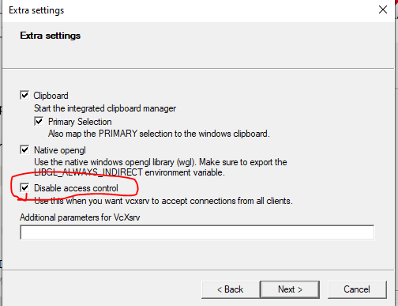

# Install WSL - Windows Subsystem for Linux
<small><i>Page last updated on: {{ git_revision_date }}</i></small>

MCCE runs on a Unix system, which is supported by Linux and Mac OSX. If you use Windows 10, the Linux subsystem is a lightweight Linux alternative to run mcce.

## Step 1. Enable the Windows Subsystem
Open the PowerShell as an Administrator and Run:
```
dism.exe /online /enable-feature /featurename:Microsoft-Windows-Subsystem-Linux /all /norestart
```

## Step 2. Enable Virtual Machine
In the PowerShell run:
```
dism.exe /online /enable-feature /featurename:VirtualMachinePlatform /all /norestart
```

## Step 3. Download the Linux kernel update package

1. Download the latest package from **one of the following links** depending on your CPU architecture:
    * [WSL2 Linux kernel update package for x64 machines](https://wslstorestorage.blob.core.windows.net/wslblob/wsl_update_x64.msi)
    * [WSL2 Linux kernel update package for AMD64](https://wslstorestorage.blob.core.windows.net/wslblob/wsl_update_arm64.msi)
2. Run the update package downloaded in the previous step. (Double-click to run - you will be prompted for elevated permissions, select ‘yes’ to approve this installation.)

## Step 4. Set WSL 2 as your default version
In the PowerShell run:
```
wsl --set-default-version 2
```

## Step 5. Install Linux
1. Open the [Microsoft Store](https://aka.ms/wslstore) and select your favorite Linux distribution.

2. From the distribution's page, select "Get".

3. Launch the Ubuntu app, and it will prompt to set up the first user account.


After installation, you can start Linux shell window by any of these methods:

* launching Ubuntu App
* using cmd terminal and run "wsl" or "bash"
* using Powershell and run "wsl" or "bash"
* using the Windows Terminal (see next section)

## Step 6. Install miniconda3
In Linux (wsl) window, run
```
wget https://repo.anaconda.com/miniconda/Miniconda3-latest-Linux-x86_64.sh
```
to download miniconda 3 installer.

Run:
```
bash Miniconda3-latest-Linux-x86_64.sh
```
and follow the instruction to install miniconda3.

## Step 7. Access Linux subsystem files
From Linux subsystem, Windows drives are mounted under /mnt:
```
C:\             511747028  455342680   56404348  89% /mnt/c
D:\            1953512444  774229312 1179283132  40% /mnt/d
F:\            5860487164 2442458764 3418028400  42% /mnt/f
```

From Windows, one can point file explore to ```\\wsl$\Ubuntu``` to see Linux file system.

## Step 8. Install Windows Terminal (Optional)
[Install Windows terminal from Microsoft Store](https://aka.ms/terminal)


Open different terminal types:

* CTRL+Shift+1: Open a powershell
* CTRL+Shift+2: Open a cmd window
* CTRL+Shift+3: Open a Linux terminal

Open a pane:

* alt+shift+plus: Open a vertical pane
* alt+shift+minus: Open a horizontal pane
* alt+shift+D: Open a new pane alternatively between vertical and horizontal modes.

To close a pane:

* type exit

## Step 9. Install Xserver for Graphic User Interface (Optional)
WSL requires a separate X server to run graphical applications. So one needs to install a X server for Windows and configure WSL to use the X server/

### Install VcXsrv
Download and install VcXsrv from here: https://sourceforge.net/projects/vcxsrv/

### Launch VcXsrv
Run xlaunch.exe under c:/Program Files/VcXsrv and make sure "Disable access control" is checked in the dialogue window.


### Configure WSL bash environment to use X server
Bash terminal in WSL should be configured to know where the Xserver is in order to run graphics. Since we installed the Xserver in windows, we need to find the Windows virtual host IP address to set the DISPLAY variable:

```
export DISPLAY=$(cat /etc/resolv.conf | grep nameserver | awk '{print $2}'):0
```

You can write this command to ~/.bashrc so that DISPLAY is automatically set every time a wsl bash window is open.

Run
```
xeyes
```
to test xserver connection. If you don't have xeyes, install it with command:
```
apt-get install x11-apps
```